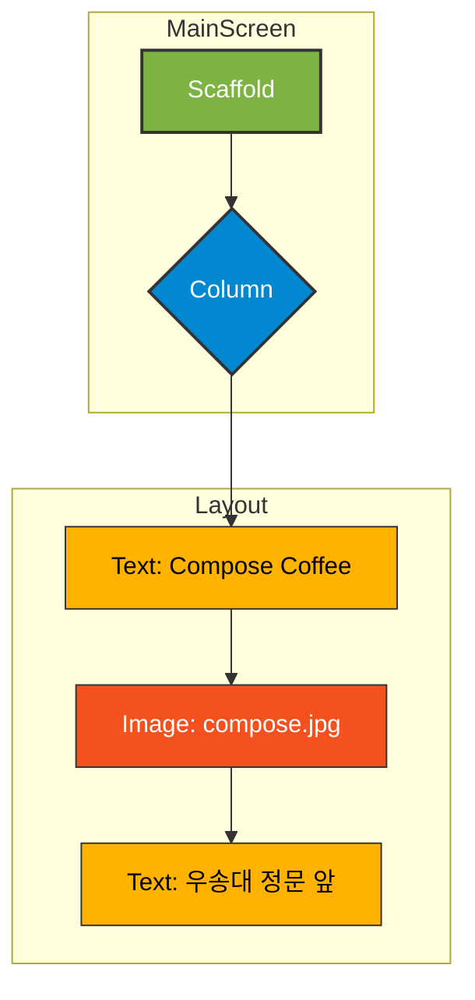

# app_01 UI 디자인 명세

## 1. 화면 개요 (Screen Overview)

이 화면은 Jetpack Compose를 사용하여 간단한 텍스트와 이미지를 화면 중앙에 세로로 배치하는 방법을 보여주는 기본 예제입니다. "Compose Coffee"라는 가상의 카페를 소개하는 내용을 담고 있습니다.

## 2. UI 구조 (UI Structure)

화면의 전체적인 레이아웃 구조는 다음과 같습니다.

## 3. 주요 컴포저블 설명 (Key Composable Descriptions)

*   **`Scaffold`**: Material Design의 기본 레이아웃 구조(상단바, 하단바, 본문 영역 등)�� 제공하는 컨테이너입니다. 이 예제에서는 화면의 전체적인 틀을 잡는 역할을 합니다.
*   **`Column`**: 자식 컴포저블들을 세로 방향으로 순차적으로 배치하는 레이아웃입니다.
    *   `modifier = Modifier.fillMaxSize()`: 화면 전체를 채우도록 크기를 설정합니다.
    *   `verticalArrangement = Arrangement.Center`: 자식들을 세로 방향으로 중앙에 정렬합니다.
    *   `horizontalAlignment = Alignment.CenterHorizontally`: 자식들을 가로 방향으로 중앙에 정렬합니다.
*   **`Text`**: 텍스트를 화면에 표시하는 컴포저블입니다. "Compose Coffee"와 "우송대 정문 앞" 두 개의 텍스트가 사용되었습니다.
*   **`Image`**: 이미지를 화면에 표시하는 컴포저블입니다. `painterResource`를 사용하여 `drawable` 폴더에 있는 `compose.jpg` 이미지를 불러와 표시합니다.
