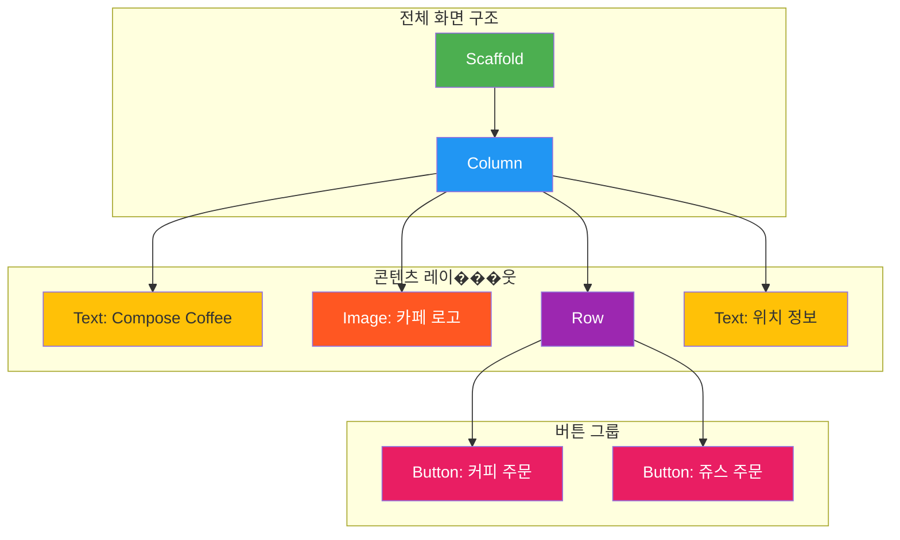

# app_01_compose_coffee UI 디자인 명세

## 1. UI 요구사항

이 화면은 Jetpack Compose를 사용하여 간단한 카페 주문 화면을 만드는 것을 목표로 합니다.

*   **요구사항 1**: 화면 상단에 "Compose Coffee" 라는 제목이 표시되어야 합니다.
*   **요구사항 2**: 제목 아래에는 카페 로고 이미지가 표시되어야 합니다.
*   **요구사항 3**: 이미지 아래에는 "커피 주문"과 "쥬스 주문" 버튼이 가로로 나란히 표시되어야 합니다.
*   **요구사항 4**: 버튼 아래에는 "위치: 우송대 정문 앞" 이라는 텍스트가 표시되어야 합니다.
*   **요구사항 5**: 모든 UI 요소는 화면의 가로 중앙에 정렬되어야 합니다.
*   **요구사항 6**: 각 요소 사이에는 적절한 간격이 있어야 합니다.

## 2. UI 구조 개요

요구사항을 만족시키기 위한 Composable 함수의 계층 구조는 다음과 같습니다.

## 3. 주요 컴포저블 설명

*   **`Scaffold`**: Material Design의 기본 레이아웃 구조를 제공하여 앱의 전체적인 틀을 잡습니다.
*   **`Column`**: 자식 Composable들을 세로 방향으로 순차적으로 배치합니다. 이 예제에서는 제목, 이미지, 버튼 그룹, 위치 정보를 세로로 정렬하는 역할을 합니다.
    *   `horizontalAlignment = Alignment.CenterHorizontally`: 자식들을 수평 중앙으로 정렬하여 일관된 모양을 유지합니다.
*   **`Text`**: "Compose Coffee" 제목과 "위치: 우송대 정문 앞" 텍스트를 표시합니다.
    *   `style = MaterialTheme.typography.headlineMedium`: 제목에 미리 정의된 글꼴 스타일을 적용합니다.
*   **`Image`**: `painterResource`를 사용하여 `drawable` 폴더의 이미지를 불러와 화면에 표시합니다.
    *   `modifier = Modifier.size(300.dp)`: 이미지의 크기를 300dp로 지정합니다.
*   **`Row`**: 자식 Composable들을 가로 방향으로 순차적으로 배치합니다. "커피 주문"과 "쥬스 주문" 버튼을 나란히 놓기 위해 사용됩니다.
*   **`Button`**: 사용자가 클릭할 수 있는 버튼을 만듭니다. 각 버튼은 `onClick` 람다를 비워두어 현재는 아무 동작도 하지 않습니다.

## 4. 미리보기(Preview) 설명

*   **`ComposeCoffeePreview`**: `@Preview` 어노테이션을 통해 UI가 의도대로 구성되었는지 실시간으로 확인할 수 있습니다.
    *   `showBackground = true` 속성은 프리뷰에 배경을 추가하여 실제 기기에서의 모습을 더 정확하게 예측하게 해줍니다.
    *   프리뷰를 통해 제목, 이미지, 두 개의 버튼, 그리고 위치 정보 텍스트가 화면 중앙에 세로로 올바르게 배치되었는지, 그리고 버튼들이 가로로 잘 정렬되었는지 검증할 수 있습니다.
