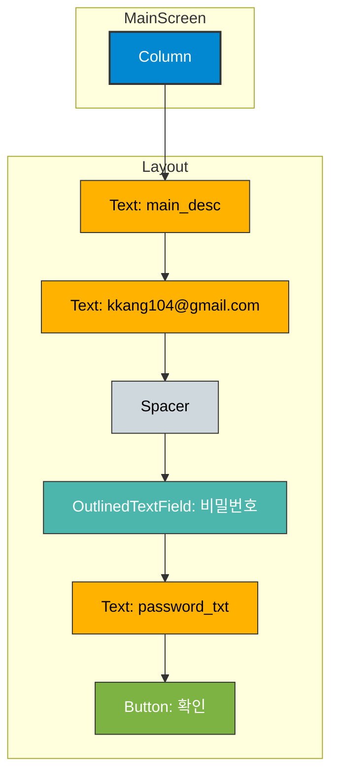

# app_02 UI 디자인 명세

## 1. 화면 개요 (Screen Overview)

이 화면은 이메일 주소를 보여주고, 사용자로부터 비밀번호를 입력받아 확인 버튼을 누르는 간단한 로그인 형태의 UI를 구현한 예제입니다. `Column`을 사용하여 UI 요소들을 세로로 배치하고, `OutlinedTextField`로 입력 필드를 만듭니다.

## 2. UI 구조 (UI Structure)

화면의 전체적인 레이아웃 구조는 다음과 같습니다.

## 3. 주요 컴포저블 설명 (Key Composable Descriptions)

*   **`Column`**: 자식 컴포저블들을 세로 방향으로 순차적으로 배치하는 레이아웃입니다.
    *   `horizontalAlignment = Alignment.Start`: 자식들을 가로 방향으로 왼쪽에 정렬합니다.
*   **`Text`**: 텍스트를 화면에 표시합니다.
    *   `stringResource`를 사용하여 `strings.xml`에 정의된 텍스트를 불러옵니다.
    *   이메일 주소, 안내 문구 등 다양한 정보를 표시하는 데 사용됩니다.
*   **`Spacer`**: UI 요소들 사이에 시각적인 간격을 만들기 위해 사용되는 빈 공간입니다. 여기서는 이메일과 비밀번호 입력 필드 사이에 회색 선을 그리는 데 사용되었습니다.
*   **`OutlinedTextField`**: Material Design의 'Outlined' 스타일을 가진 텍스트 입력 필드입니다.
    *   `placeholder`: 입력 필드가 비어있을 때 보여주는 힌트 텍스트("비밀번호")입니다.
    *   `visualTransformation = PasswordVisualTransformation()`: 입력된 텍스트를 `*` 문자로 보여주어 비밀번호의 프라이버시를 보호합니다.
    *   `keyboardOptions = KeyboardOptions(keyboardType = KeyboardType.Password)`: 사용자가 이 필드를 터치했을 때 나타나는 가상 키보드의 종류를 비밀번호용으로 설정합니다.
*   **`Button`**: 사용자가 클릭할 수 있는 버튼입니다. "확인" 텍스트를 포함하고 있으며, 클릭 시 특정 동작을 수행할 수 있습니다. (현재 `onClick`은 비어있습니다.)
*   **`Surface`**: 배경색을 지정하고 UI 요소들을 그룹화하는 데 사용되는 컨테이너입니다. 이 예제에서는 전체 화면의 배경색을 옅은 분홍색으로 설정합니다.
