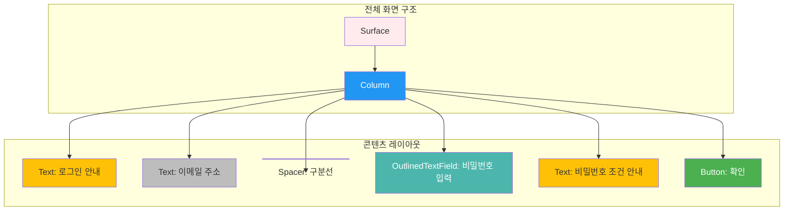

# app_02_kakao_email UI 디자인 명세

## 1. UI 요구사항

이 화면은 카카오계정 로그인 UI를 모방하여, 사용자에게 이메일 주소를 보여주고 비밀번호 입력을 요청하는 화면을 만드는 것을 목표로 합니다.

*   **요구사항 1**: 화면 상단에 "카카오계정으로 로그인하세요." 라는 안내 문구가 표시되어야 합니다.
*   **요구사항 2**: 안내 문구 아래에 로그인할 이메일 주소("kkang104@gmail.com")가 회색으로 표시되어야 합니다.
*   **요구사항 3**: 이메일 주소와 비밀번호 입력 필드 사이에는 회색 구분선이 있어야 합니다.
*   **요구사항 4**: 사용자로부터 비밀번호를 입력받을 수 있는 `OutlinedTextField`가 있어야 하며, "비밀번호"라는 힌트 텍스트가 표시되어야 합니다.
*   **요구사항 5**: 입력 필드 아래에는 "비밀번호는 8~32자리의 영문 대소문자, 숫자, 특수문자를 조합하여 설정해 주세요." 라는 안내 문구가 있어야 합니다.
*   **요구사항 6**: 화면 하단에는 "확인" 버튼이 있어야 하고, 이 버튼은 화면 가로 폭을 꽉 채워야 합니다.
*   **요구사항 7**: 전체 화면의 배경색은 옅은 분홍색(#FFEBEE)으로 지정합니다.

## 2. UI 구조 개요

요구사항을 만족시키기 위한 Composable 함수의 계층 구조는 다음과 같습니다.

## 3. 주요 컴포저블 설명

*   **`Surface`**: UI 요소들을 감싸는 컨테이너로, 배경색을 옅은 분홍색(`Color(0xFFFFEBEE)`)으로 설정하는 역할을 합니다.
*   **`Column`**: 자식 Composable들을 세로 방향으로 순차적으로 배치합니다.
    *   `modifier = Modifier.padding(16.dp)`: 화면 가장자리에 16dp의 여백을 추가합니다.
*   **`Text`**: 다양한 안내 문구와 이메일 주소를 화면에 표시합니다.
    *   `stringResource`를 사용하여 `strings.xml`에 정의된 텍스트를 불러와 다국어 지원을 용이하게 합니다.
*   **`Spacer`**: UI 요소 사이에 1dp 높이의 회색(`Color(0xFFD4D4D3)`) 구분선을 만들어 시각적인 구분을 줍니다.
*   **`OutlinedTextField`**: 사용자가 텍스트를 입력할 수 있는 필드입니다.
    *   `placeholder`: 입력 필드가 비어있을 때 "비밀번호"라는 힌트를 보여줍니다.
    *   `visualTransformation = PasswordVisualTransformation()`: 입력된 내용을 `*`로 마스킹하여 비밀번호를 보호합니다.
    *   `keyboardOptions = KeyboardOptions(keyboardType = KeyboardType.Password)`: 비밀번호 입력에 최적화된 키보��를 표시합니다.
*   **`Button`**: "확인" 동작을 수행하는 버튼입니다.
    *   `modifier = Modifier.fillMaxWidth()`: 버튼의 너비를 화면 가로 폭 전체로 확장합니다.

## 4. 미리보기(Preview) 설명

*   **`GreetingPreview`**: `@Preview` 어노테이션을 통해 개발 중 UI의 실시간 모습을 확인할 수 있습니다.
    *   `showBackground = true` 속성과 `Surface`의 배경색 설정을 통해, 실제 앱과 거의 동일한 배경색과 UI 구성을 미리 볼 수 있습니다.
    *   프리뷰를 통해 모든 UI 요소들이 수직으로 올바르게 정렬되었는지, 텍스트와 입력 필드가 정확히 표시되는지, 그리고 버튼이 화면 너비를 채우는지 등을 시각적으로 검증할 수 있습니다.