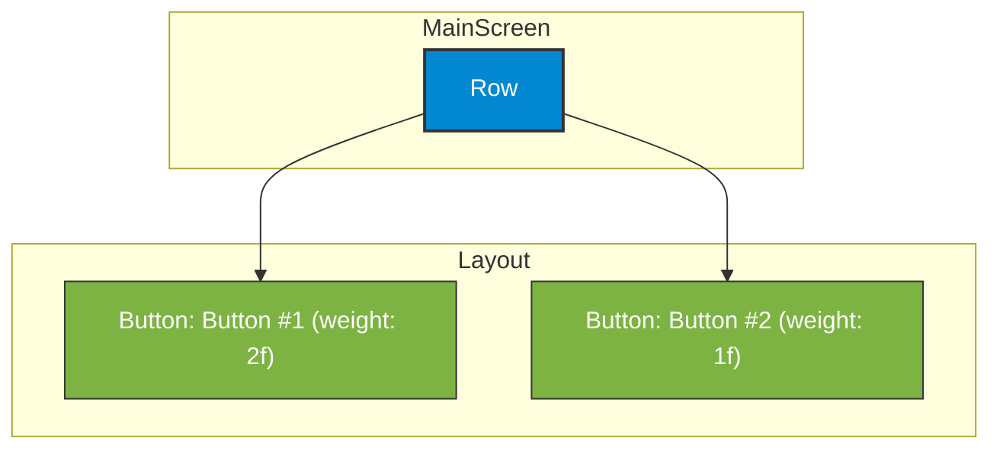

# app_03 UI 디자인 명세

## 1. 화면 개요 (Screen Overview)

이 화면은 `Row` 레이아웃을 사용하여 두 개의 `Button`을 가로로 배치하는 방법을 보여줍니다. `Modifier.weight()`를 이용하여 가로 공간을 특정 비율(2:1)로 분할하여 차지하는 방법을 학습하는 예제입니다.

## 2. UI 구조 (UI Structure)

화면의 전체적인 레이아웃 구조는 다음과 같습니다.

## 3. 주요 컴포저블 설명 (Key Composable Descriptions)

*   **`Row`**: 자식 컴포저블들을 가로 방향으로 순차적으로 배치하는 레이아웃입니다.
    *   `modifier = Modifier.fillMaxWidth()`: 화면의 전체 가로 너비를 채우도록 설정합니다.
*   **`Button`**: 사용자가 클릭할 수 있는 버튼입니다.
    *   `modifier = Modifier.weight(2f)`: 첫 번째 버튼은 `Row` 내부에서 사용 가능한 가로 공간의 2/3를 차지합니다.
    *   `modifier = Modifier.weight(1f)`: 두 번째 버튼은 `Row` 내부에서 사용 가능한 가로 공간의 1/3을 차지합니다.
    * `weight` 속성은 `Row`나 `Column` 같은 레이아웃 내에서 자식들이 차지할 공간의 비율을 동적으로 결정할 때 매우 유용합니다.
