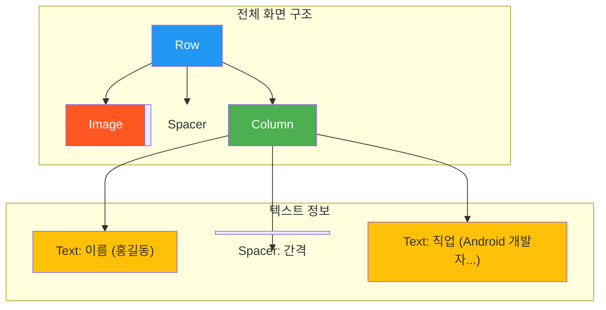

# app_03_profile UI 디자인 명세

## 1. UI 요구사항

이 화면은 사용자 프로필 정보를 보여주는 간단한 "프로필 카드" UI를 만드는 것을 목표로 합니다.

*   **요구사항 1**: 원형의 프로필 이미지가 왼쪽에 표시되어야 합니다.
*   **요구사항 2**: 이미지 오른쪽에는 사용자의 이름과 직업(또는 상태 메시지)이 세로로 표시되어야 합니다.
*   **요구사항 3**: 이름은 더 큰 글꼴 스타일(titleMedium)로, 직업은 일반 본문 스타일(bodyMedium)로 표시되어야 합니다.
*   **요구사항 4**: 이미지와 텍스트 그룹은 전체적으로 가로로 정렬되어야 합니다.
*   **요구사항 5**: 각 UI 요소 사이에는 적절한 간격이 있어야 합니다.

## 2. UI 구조 개요

요구사항을 만족시키기 위한 Composable 함수의 계층 구조는 다음과 같습니다.

## 3. 주요 컴포저블 설명

*   **`Row`**: 프로필 카드 전체를 감싸는 최상위 레이아웃으로, 자식 요소인 `Image`와 `Column`을 가로로 배치합니다.
    *   `modifier = Modifier.padding(all = 8.dp)`: 카드 주변에 8dp의 여백을 추가합니다.
*   **`Image`**: 사용자의 프로필 사진을 표시합니다.
    *   `painter = painterResource(R.drawable.profile_picture)`: `drawable` 리소스에 있는 이미지를 불러옵니다.
    *   `modifier = Modifier.size(40.dp).clip(CircleShape)`: 이미지 크기를 40dp로 고정하고, `clip(CircleShape)`를 이용해 원형으로 잘라냅니다.
*   **`Spacer`**: UI 요소들 사이에 고정된 크기의 빈 공간을 만들어 간격을 조절합니다.
    *   `Modifier.width(8.dp)`: 이미지와 텍스트 `Column` 사이에 8dp의 가로 간격을 만듭니다.
    *   `Modifier.height(4.dp)`: 이름과 직업 텍스트 사이에 4dp의 세로 간격을 만듭니다.
*   **`Column`**: 이름(`author`)과 직업(`body`) 텍스트를 세로로 배치합니다.
*   **`Text`**: 텍스트를 표시합니다.
    *   `style = MaterialTheme.typography.titleMedium`: 이름에 Material Design의 `titleMedium` 스타일을 적용하여 강조합니다.
    *   `style = MaterialTheme.typography.bodyMedium`: 직업 텍스트에 `bodyMedium` 스타일을 적용합니다.

## 4. 미리보기(Preview) 설명

*   **`ProfileCardPreview`**: `@Preview` 어노테이션을 통해 `ProfileCard` Composable의 최종 결과물을 실시간으로 확인할 수 있습니다.
*   **단계별 프리뷰**: 이 모듈에는 `TwoButtonsPreview`, `TwoButtonsWithModifierPreview`, `ProfileCardPreview` 세 개의 프리뷰가 포함되어 있습니다.
    1.  `TwoButtonsPreview`: `Row`의 기본 사용법을 보여줍니다.
    2.  `TwoButtonsWithModifierPreview`: `Row` 내에서 `weight`를 사용�� 공간 분할을 보여줍니다.
    3.  `ProfileCardPreview`: `Row`, `Column`, `Image`, `Spacer` 등을 조합하여 최종 프로필 카드를 완성하는 과정을 보여줍니다.
*   학생들은 각 프리뷰를 통해 코드가 어떻게 점진적으로 발전하여 최종 UI를 구성하는지 단계별로 학습하고 시각적으로 검증할 수 있습니다.