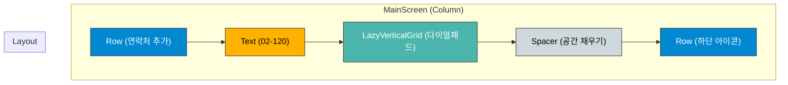

# app_04 UI 디자인 명세

## 1. 화면 개요 (Screen Overview)

이 화면은 전화 앱의 다이얼패드 UI를 구현한 예제입니다. `Column`을 사용하여 전체적인 세로 레이아웃을 구성하고, `LazyVerticalGrid`를 이용해 숫자 키패드를 효율적으로 그립니다. 상단과 하단에는 `Row`를 사용하여 아이콘과 텍스트를 배치합니다.

## 2. UI 구조 (UI Structure)

화면의 전체적인 레이아웃 구조는 다음과 같습니다.

## 3. 주요 컴포저블 설명 (Key Composable Descriptions)

*   **`Column`**: 화면의 전체적인 세로 배치를 담당하는 기본 컨테이너입니다.
*   **`Row`**: "연락처 추가" 텍스트와 아이콘, 그리고 하단의 "영상통화", "전화", "뒤로가기" 아이콘들을 가로로 배치하는 데 사용됩니다.
*   **`Icon`**: 벡터 드로어블(`add.xml`)을 화면에 표시합니다. `tint` 속성을 사용하여 아이콘의 색상을 초록색으로 지정합니다.
*   **`Text`**: "연락처 추가"나 전화번호("02-120") 같은 텍스트 정보를 표시합니다. `fontSize`, `fontWeight` 등의 속성으로 스타일을 지정합니다.
*   **`LazyVerticalGrid`**: 스크롤이 가능한 수직 그리드 레이아웃입니다. 다이얼패드의 숫자 키(0-9, *, #)들을 3열(`GridCells.Fixed(3)`)로 효율적으로 표시하는 데 사용됩니다.
*   **`DialPadKey` (Composable)**: 각 다이얼패드 키의 UI를 정의하는 별도의 함수입니다. `Box`를 사용하여 키 내부의 텍스트를 중앙에 배치합니다.
*   **`Spacer`**: `modifier = Modifier.weight(1f)`와 함께 사용되어 다이얼패드와 하단 아이콘 `Row` 사이의 남는 공간을 모두 차지하게 함으로써, 하단 아이콘들이 화면 맨 아래에 위치하도록 만듭니다.
*   **`Image`**: 비트맵 이미지(`video.png`, `call.png`, `back.png`)를 ��면에 표시하는 데 사용됩니다.
