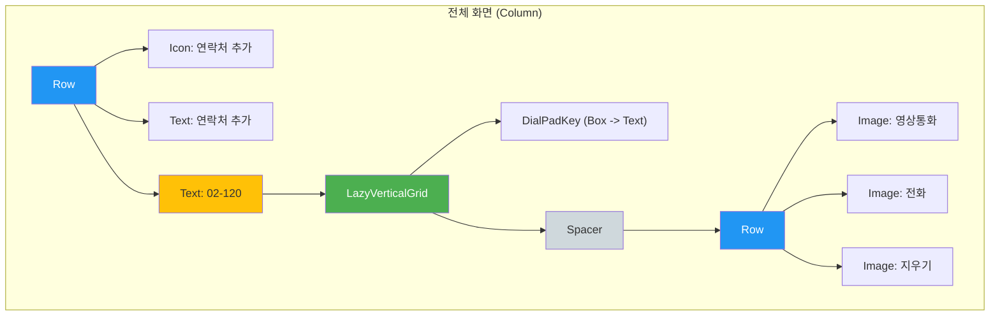

# app_04_keypad UI 디자인 명세

## 1. UI 요구사항

이 화면은 스마트폰의 전화 다이얼패드와 유사한 UI를 만드는 것을 목표로 합니다.

*   **요구사항 1**: 화면 상단에는 "연락처 추가" 텍스트와 아이콘이 표시되어야 합니다.
*   **요구사항 2**: 화면 중앙에는 입력된 전화번호("02-120")가 큰 글씨로 표시되어야 합니다.
*   **요구사항 3**: 전화번호 아래에는 3x4 그리드 형태의 숫자 키패드가 표시되어야 합니다. (1-9, *, 0, #)
*   **요구사항 4**: 화면 하단에는 "영상통화", "전화", "지우기" 아이콘이 가로로 나란히 표시되어야 합니다.
*   **요구사항 5**: 전체 UI 요소들은 세로로 배치되고, 수평 중앙 정렬되어야 합니다.

## 2. UI 구조 개요

요구사항을 만족시키기 위한 Composable 함수의 계층 구조는 다음과 같습니다.

## 3. 주요 컴포저블 설명

*   **`Column`**: 화면의 모든 UI 요소를 수직으로 배치하는 최상위 컨테이너입니다.
    *   `horizontalAlignment = Alignment.CenterHorizontally`: 자식 요소들을 수평 중앙에 정렬합니다.
*   **`Row`**: "연락처 추가" 부분과 하단 아이콘 그룹처럼, 여러 요소를 수평으로 나란히 배치할 때 사용됩니다.
*   **`Icon`**: 벡터 드로어블(`R.drawable.add`)을 표시합니다. `tint` 속성을 사용하여 아이콘의 색상을 변경할 수 있습니다.
*   **`Text`**: 전화번호나 "연락처 ��가"와 같은 텍스트를 표시합니다. `fontSize`, `fontWeight` 등으로 스타일을 지정합니다.
*   **`LazyVerticalGrid`**: 스크롤이 가능한 그리드(격자) 레이아웃을 만듭니다. 많은 수의 아이템을 효율적으로 표시할 때 유용합니다.
    *   `columns = GridCells.Fixed(3)`: 그리드를 3개의 열로 고정합니다.
    *   숫자 키패드를 만드는 데 사용되었습니다.
*   **`DialPadKey` (Custom Composable)**: 각 키패드 버튼의 UI를 재사용하기 위해 만든 커스텀 Composable입니다. `Box`를 사용하여 숫자 텍스트를 중앙에 배치합니다.
*   **`Spacer`**: `modifier = Modifier.weight(1f)` 속성과 함께 사용되어, 키패드와 하단 아이콘 사이의 남는 공간을 모두 차지합니다. 이로 인해 하단 아이콘 `Row`가 화면 맨 아래에 고정되는 효과를 줍니다.
*   **`Image`**: 비트맵 이미지(PNG, JPG 등)를 표시할 때 사용됩니다. 하단의 아이콘들을 표시하는 데 사용되었습니다.

## 4. 미리보기(Preview) 설명

*   **`MainScreenPreview`**: `@Preview` 어노테이션을 통해 `MainScreen` Composable의 전체적인 UI 레이아웃을 확인할 수 있습니다.
    *   `showBackground = true` 속성으로 프리뷰에 흰색 배경이 생겨, UI 요소들이 더 명확하게 보입니다.
    *   프리뷰를 통해 상단 "연락처 추가", 중앙의 전화번호, 다이얼패드, 그리고 하단의 아이콘들이 의도한 대로 수직/수평 정렬되었는지 시각적으로 검증할 수 있습니다.