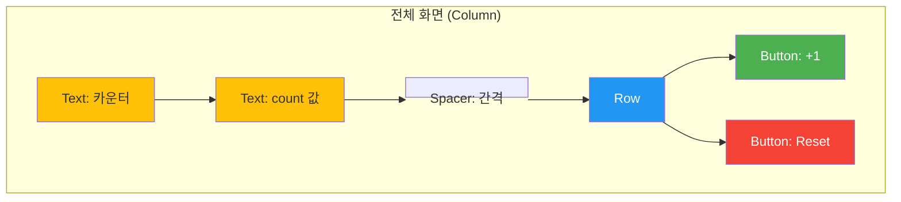

# app_05_count UI 디자인 명세

## 1. UI 요구사항

이 화면은 Jetpack Compose의 핵심 원리인 **상태(State)** 와 **리컴포지션(Recomposition)** 을 학습하기 위한 간단한 카운터 앱을 만드는 것을 목표로 합니다.

*   **요구사항 1**: 화면 중앙에 "카운터"라는 제목과 현재 숫자를 표시해야 합니다.
*   **요구사항 2**: 숫자 아래에는 `+1` 버튼과 `Reset` 버튼이 가로로 나란히 있어야 합니다.
*   **요구사항 3**: `+1` 버튼을 클릭하면 숫자가 1씩 증가해야 합니다.
*   **요구사항 4**: `Reset` 버튼을 클릭하면 숫자가 0으로 초기화되어야 합니다.
*   **요구사항 5**: 전체 UI는 화면의 가로 �� 세로 중앙에 정렬되어야 합니다.
*   **요구사항 6**: 배경색은 옅은 분홍색(`light_pink`)으로 지정합니다.

## 2. UI 구조 개요

요구사항을 만족시키기 위한 Composable 함수의 계층 구조는 다음과 같습니다.

## 3. 주요 컴포저블 및 개념 설명

*   **`var count by remember { mutableStateOf(0) }`**: Compose에서 상태를 선언하는 핵심 코드입니다.
    *   **`mutableStateOf(0)`**: 값이 변경될 때 Compose 런타임에 알릴 수 있는, 관찰 가능한 `State<T>` 객체를 생성합니다. 초기값은 `0`입니다.
    *   **`remember`**: Composable이 재구성(Recomposition)될 때 상태(`count`)가 `0`으로 초기화되지 않고, 이전 값을 계속 기억하게 해주는 마법 같은 함수입니다.
    *   **`by` (Delegate)**: `.value` 없이 `count` 변수처럼 직접 값을 읽고 쓸 수 있게 해주는 코틀린 기능입니다. (예: `count++`는 내부적으로 `count.value++`와 같습니다.)

*   **리컴포지션 (Recomposition)**: `count`와 같이 `State`로 선언된 값이 변경되면, Compose는 이 `State`를 읽는 모든 Composable을 자동으로 다시 실행(재구성)하여 화면을 업데이트합니다. 이 예제에서는 `count` 값이 바뀔 때마다 `Text(text = count.toString())` 부분이 다시 그려집니다.

*   **`Column`**: 자식 요소들을 수직으로 배치하고, `verticalArrangement = Arrangement.Center`와 `horizontalAlignment = Alignment.CenterHorizontally`를 통해 화면 중앙에 정렬합니다.

*   **`Button`**: 클릭 가능한 버튼입니다.
    *   `onClick = { count++ }`: `+1` 버튼이 클릭되면 `count` 상태를 1 증가시킵니다. 이 상태 변경이 리컴포지션을 유발합니다.
    *   `onClick = { count = 0 }`: `Reset` 버튼이 클릭되면 `count` 상태를 0으로 설정합니다. 이 또한 리컴포지션을 유발합니다.

## 4. 미리보기(Preview) 설명

*   **`ButtonCounterScreenPreview`**: `@Preview`를 통해 `ButtonCounterScreen`의 UI를 확인할 수 있습니다.
*   **`ClickCounterScreenPreview`**: 이 모듈에는 `Column` 전체에 `clickable` Modifier를 적용하여 카운터를 증가시키는 더 간단한 버전의 예제도 포함되어 있습니다.
*   학생들은 두 프리뷰를 비교하며, 동일한 상태 관리 로직이 어떻게 다른 UI(전체 화면 클릭 vs. 버튼 클릭)와 결합될 수 있는지 학습할 수 있습니다. 이를 통해 **상태 로직과 UI 렌더링의 분리**라는 중요한 개념을 이해할 수 있습니다.