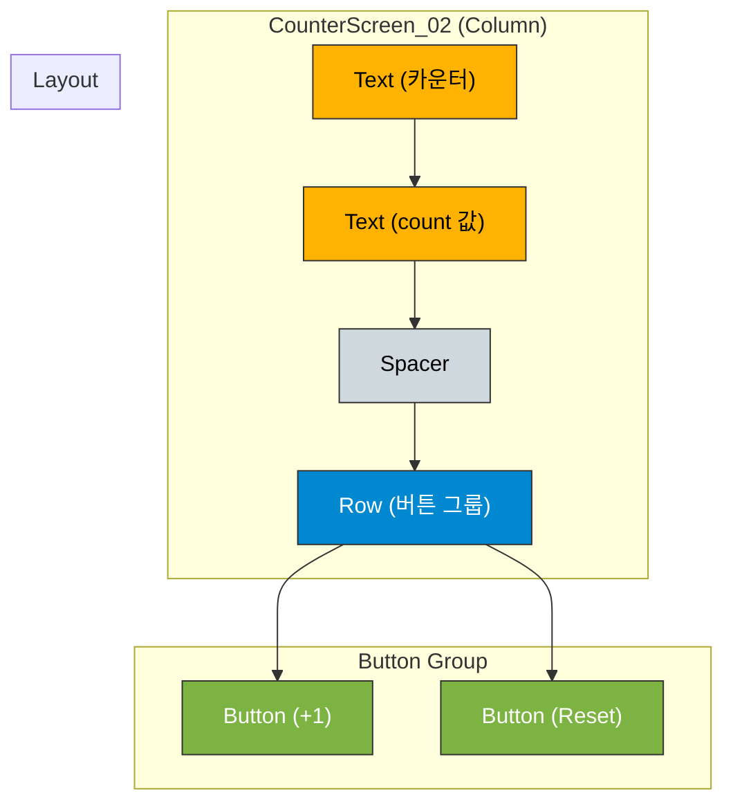

# app_05 UI 디자인 명세

## 1. 화면 개요 (Screen Overview)

이 화면은 Jetpack Compose의 핵심 개념인 **상태(State)** 관리를 보여주는 카운터 앱 예제입니다. `remember`와 `mutableStateOf`를 사용하여 컴포저블이 자신의 상태(`count`)를 기억하고, 버튼 클릭에 따라 상태를 변경하며 UI를 자동으로 업데이트(Recomposition)하는 방법을 학습합니다.

## 2. UI 구조 (UI Structure)

화면의 전체적인 레이아웃 구조는 다음과 같습니다.

## 3. 주요 컴포저블 및 개념 설명 (Key Composable & Concept Descriptions)

*   **`var count by remember { mutableStateOf(0) }`**:
    *   **`mutableStateOf(0)`**: `0`이라는 초기값을 가지는, 관찰 가능한 `MutableState` 객체를 생성합니다. 이 값은 변경될 수 있습니다.
    *   **`remember`**: Composable이 리컴포지션(Recomposition) 되더라도 `mutableStateOf`로 생성된 상태를 메모리에서 유지시켜주는 역할을 합니다. `remember`가 없으면 화면이 다시 그려질 때마다 `count`가 `0`으로 초기화됩니다.
    *   **`var count by`**: `by` 위임(delegation)을 사용하여 `.value` 없이 `count` 변수에 직접 값을 읽고 쓸 수 있게 해주는 Kotlin 문법입니다. (`count++`는 `count.value++`와 동일합니다.)

*   **`Column`**: 화면의 UI 요소들을 세로로 배치하고 중앙에 정렬합니다.

*   **`Text`**: "카운터"라는 제목과 현재 `count` 상태 값을 화면에 표시합니다. `count` 상태가 변경되면 이 `Text` 컴포저블은 자동으로 리컴포지션되어 새로운 값을 보여줍니다.

*   **`Row`**: `+1` 버튼과 `Reset` 버튼을 가로로 나란히 배치합니다.

*   **`Button`**:
    *   **`onClick = { count++ }`**: `+1` 버��이 클릭될 때마다 `count` 상태를 1 증가시킵니다. 상태가 변경되면 UI가 자동으로 업데이트됩니다.
    *   **`onClick = { count = 0 }`**: `Reset` 버튼이 클릭될 때 `count` 상태를 `0`으로 재설정합니다.
