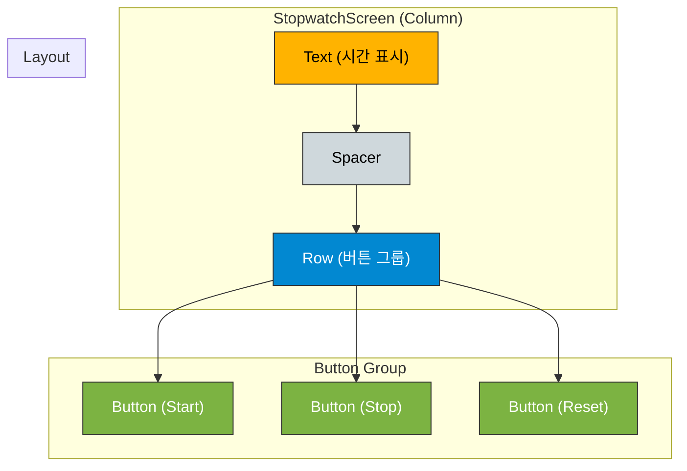

# app_06 UI 디자인 명세

## 1. 화면 개요 (Screen Overview)

이 화면은 스톱워치 기능을 구현한 예제입니다. `LaunchedEffect`를 사용하여 코루틴 기반의 타이머를 실행하고, 여러 `MutableState` 변수들을 조합하여 시작, 중지, 초기화 기능을 관리합니다. 또한, `BackHandler`를 사용하여 "뒤로가기" 버튼 동작을 가로채 '한 번 더 누르면 종료' 기능을 구현하는 방법을 보여줍니다.

## 2. UI 구조 (UI Structure)

화면의 전체적인 레이아웃 구조는 다음과 같습니다.

## 3. 주요 컴포저블 및 개념 설명 (Key Composable & Concept Descriptions)

*   **`remember { mutableStateOf(...) }`**:
    *   `time`: 현재 스톱워치 시간을 저장합니다.
    *   `isRunning`: 스톱워치가 현재 실행 중인지 여부를 나타내는 `Boolean` 상태입니다.
    *   `lastBackPressedTime`: '뒤로가기' 버튼을 마지막으로 누른 시간을 기록합니다.
    *   `startTime`, `pauseOffset`: 정확한 시간 측정을 위해 시작 시간과 일시정지 시간을 관리합니다.

*   **`LaunchedEffect(isRunning.value)`**:
    *   `key`로 지정된 `isRunning.value`가 `true`로 변경될 때마다 내부의 코루틴 블록을 실행합니다.
    *   `while (isRunning.value)` 루프를 통해 스톱워치가 실행 중일 때만 100ms 간격(`delay(100L)`)으로 `time` 상태를 계속 업데이트합니다. `isRunning`이 `false`가 되면 루프가 중단됩니다.
    *   컴포지션의 생명주기에 맞춰 안전하게 코루틴을 실행하고 취소하기 위한 핵심적인 Side-Effect 핸들러입니다.

*   **`BackHandler`**:
    *   사용자가 물리적/가상 '뒤로가기' 버튼을 눌렀을 때의 기본 동작을 재정의합니다.
    *   3초 이내에 두 번 누르면 앱을 종료(`finish()`)하고, 그렇지 않으면 `Toast` 메시지를 표시하여 사용자에게 안내합니다.

*   **`Column` / `Row` / `Button`**:
    *   UI 요소들을 세로 및 가로로 배치하고, `enabled` 속성을 `isRunning` 상태와 연결하여 현재 스톱워치 상태에 따라 버튼의 활성화/비활성화 상태를 동적으로 제어합니다.
    *   예를 들어, `Start` 버튼은 `!isRunning.value`일 때만 활성화됩니다.
