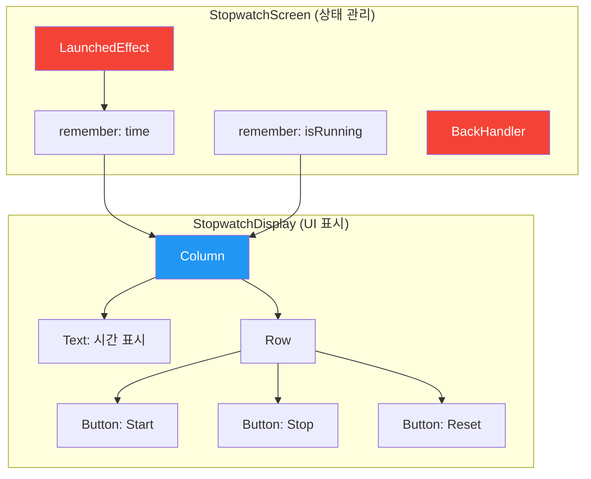

# app_06_stopwatch UI 디자인 명세

## 1. UI 요구사항

이 화면은 기본적인 스톱워치 애플리케이션을 만드는 것을 목표로 합니다.

*   **요구사항 1**: 화면 중앙에 "분:초" 형식으로 시간이 표시되어야 합니다.
*   **요구사항 2**: 시간 아래에는 "Start", "Stop", "Reset" 버튼이 가로로 나란히 있어야 합니다.
*   **요구사항 3**: "Start" 버튼을 누르면 시간이 0.1초 단위로 증가해야 합니다.
*   **요구사항 4**: "Stop" 버튼을 누르면 시간 증가가 멈춰야 합니다.
*   **요구사항 5**: "Reset" 버튼을 누르면 시간이 "00:00"으로 초기화되어야 합니다.
*   **요구사항 6**: 스톱워치 상태에 따라 버튼이 적절하게 활성화/비활성화 되어야 합니다. (예: 실행 중에는 Start 버튼 비활성화)
*   **요구사항 7**: 뒤로가기 버튼을 3초 내에 두 번 누르면 앱이 종료되고, 한 번만 누르면 안내 메시지가 표시되어야 합니다.

## 2. UI 구조 개요

이 앱은 UI를 표시하는 `StopwatchDisplay`와 상태 로직을 처리하는 `StopwatchScreen` 두 개의 Composable로 구조화되어 있습니다.

## 3. 주요 컴포저블 및 개념 설명

*   **상태와 UI의 분리**:
    *   **`StopwatchScreen`**: `time`, `isRunning` 등 스톱워치의 **상태(State)** 를 `remember { mutableStateOf(...) }`로 관리하고, `LaunchedEffect`를 통해 타이머 로직을 처리하는 **상태 홀더(State Holder)** 역할을 합니다.
    *   **`StopwatchDisplay`**: `StopwatchScreen`으로부터 시간 문자열과 버튼 클릭 람다 함수를 파라미터로 전달받아 **화면에 그리기만 하는** 단순한 Composable입니다. 이렇게 역할을 분리하면 UI 테스트와 재사용이 용이해집니다.

*   **`LaunchedEffect(isRunning.value)`**: Compose에서 **Side Effect**를 처리하는 핵심적인 방법 중 하나입니다.
    *   `key`로 지정된 `isRunning.value`가 `true`로 바뀔 때, `while` 루프를 포함한 코루틴이 실행되어 0.1초마다(`delay(100L)`) 시간을 업데이트합니다.
    *   `isRunning.value`가 `false`로 바뀌면, Compose는 이 코루틴을 자동으로 취소하여 리소스 낭비를 막습니다.

*   **`BackHandler`**: 사용자의 뒤로가기 버튼 입력을 가로채서 커스텀 동작을 구현하게 해주는 Composable입니다.
    *   마지막으로 버튼을 누른 시간을 `remember`로 기억해두고, 현재 시간과 비교하여 3초 내에 다시 눌렸는지 판단합니다.

*   **버튼 활성화/비활성화 로직**:
    *   `Button`의 `enabled` 파라미터에 `isRunning`과 같은 상태 변수를 연결하여, 현재 앱의 상태에 따라 사용자의 버튼 클릭 가능 여부를 동적으로 제어합니다.
    *   (예: `onStartClick` 버튼의 `enabled = !isRunning.value`)

## 4. 미리보기(Preview) 설명

*   **`StopwatchDisplayPreview`**: `@Preview`는 상태 로직이 없는 `StopwatchDisplay` Composable을 대상으로 합니다.
    *   "01:23"과 같은 임의의 데이터를 직접 전달하여, 스톱워치의 실제 동작과 상관없이 UI가 어떻게 보이는지만 독립적으로 확인하고 테스트할 수 있습니다.
    *   이는 **상태와 UI를 분리**했을 때 얻을 수 있는 큰 장점 중 하나입니다.