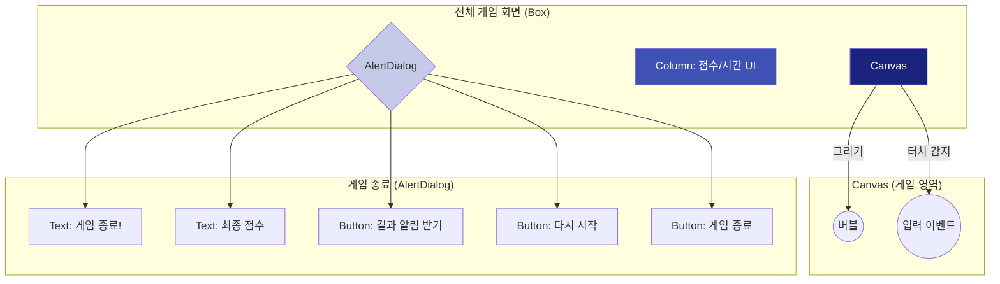

# app_98_bubble_game UI 디자인 명세

## 1. UI 요구사항

이 화면은 Jetpack Compose를 사용하여 인터랙티브한 '버블 터뜨리기' 게임을 만드는 것을 목표로 합니다. 이 과정에서 그래픽 처리, 사용자 입력, 상태 관리, 그리고 안드로이드 시스템 서비스(소리, 진동, 알림) 연동 방법을 학습합니다.

*   **게임 플레이 요구사항**:
    *   **요구사항 1-1**: 게임이 시작되면 화면의 무작위 위치에 다양한 크기와 색상의 버블이 나타나야 합니다.
    *   **요구사항 1-2**: 버블은 3초 후에 자동으로 사라져야 합니다.
    *   **요구사항 1-3**: 사용자가 버블을 터치하면 버블이 사라지고 점수가 1점씩 올라가야 합니다.
    *   **요구사항 1-4**: 버블을 터뜨릴 때 '뽁'하는 소리와 함께 짧은 진동이 울려야 합니다.
    *   **요구사항 1-5**: 게임은 30초의 시간 제한을 가집니다.

*   **UI/UX 요구사항**:
    *   **요구사항 2-1**: 화면 상단에 현재 점수와 남은 시간이 실시간으로 표시되어야 합니다.
    *   **요구사항 2-2**: 제한 시간이 다 되면 "게임 종료!" 다이얼���그가 나타나 최종 점수를 보여줘야 합니다.
    *   **요구사항 2-3**: 다이얼로그에는 게임을 "다시 시작"하는 버튼과, 게임 결과를 시스템 "알림"으로 받는 버튼, 그리고 "게임 종료" 버튼이 있어야 합니다.
    *   **요구사항 2-4**: 시스템 알림에는 사용자가 직접 답장을 보낼 수 있는 'RemoteInput' 기능이 포함되어야 합니다.

## 2. UI 구조 개요

이 게임은 `Canvas`를 중심으로, 게임 상태에 따라 UI가 동적으로 변화하는 구조입니다.

## 3. 주요 컴포저블 및 개념 설명

*   **`Canvas`**: Compose에서 직접 2D 그래픽을 그릴 수 있�� 강력한 도구입니다. `drawCircle`을 사용하여 버블을 그리고, `pointerInput` Modifier와 `detectTapGestures`를 조합하여 사용자의 터치 위치를 정확하게 감지합니다.

*   **`GameState` (상태 관리 클래스)**: 게임의 모든 상태(버블 목록, 점수, 시간, 버블 속도 등)를 하나의 클래스로 묶어서 관리합니다. `mutableStateOf`로 각 프로퍼티를 선언하여, 상태 변경 시 UI가 자동으로 리컴포지션되도록 합니다.

*   **`LaunchedEffect` (게임 루프)**: 게임의 핵심 로직을 담당하는 두 개의 `LaunchedEffect`가 사용됩니다.
    1.  **타이머 루프**: `while (gameState.gameTime > 0)` 루프를 돌며 1초마다 `gameTime`을 1씩 감소시킵니다.
    2.  **버블 관리 및 이동 루프**: `while (!gameState.isGameOver)` 루프를 돌며, 생성된 지 3초가 지난 버블을 목록에서 제거하고, 버블의 위치를 업데이트하여 이동시키며, 0.1초마다 확률적으로 새 버블을 추가합니다.

*   **시스템 서비스 연동**:
    
    *   **`Vibrator`**: 사용자에게 촉각적인 피드백을 제공하기 위해 진동 기능을 사용합니다.
    *   **`NotificationManager` & `NotificationCompat`**: 게임 결과를 시���템 알림으로 보냅니다. `RemoteInput`을 사용하여 사용자가 알림에서 직접 텍스트 답장을 보낼 수 있는 고급 기능까지 구현합니다.
    *   **`rememberLauncherForActivityResult`**: 알림 권한(Android 13 이상)을 사용자에게 요청하고 그 결과를 비동기적으로 처리하기 위해 사용됩니다.

## 4. 미리보기 및 학습 단계

*   이 모듈은 `BubbleGameStep1`부터 `BubbleGameStep5`까지 점진적으로 기능이 추가되는 여러 Composable 함수를 포함하고 있습니다.
*   학생들은 각 단계의 프리뷰(`BubbleGameStep1Preview`, `BubbleGameStep2Preview` 등)를 통해, 기본 게임 로직에서 시작하여 다이얼로그, 소리, 진동, 알림 기능이 어떻게 순서대로 통합되는지 단계별로 학습할 수 있습니다. 최종적으로 `BubbleGameStep5`가 모든 기능이 합쳐진 완성된 게임입니다.