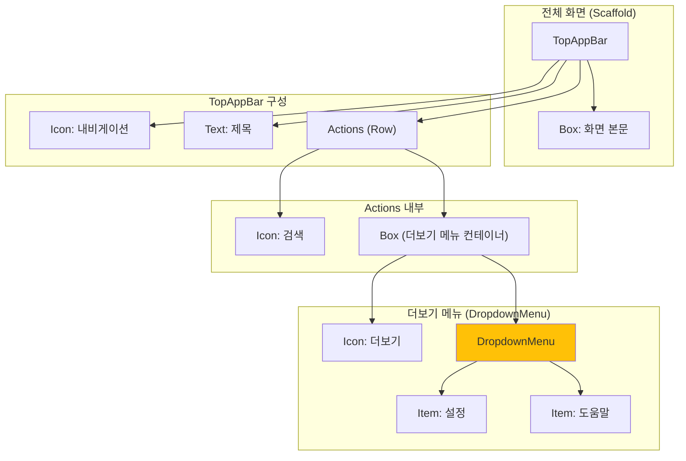

# app_11_dropdown UI 디자인 명세

## 1. UI 요구사항

이 화면은 Material Design의 `TopAppBar`를 사용하여 앱의 상단 바를 구성하는 것을 목표로 합니다.

*   **요구사항 1**: 상단 바의 왼쪽에 내비게이션 아이콘(햄버거 메뉴)이 표시되어야 합니다.
*   **요구사항 2**: 상단 바의 중앙에 "My App"이라는 제목이 표시되어야 합니다.
*   **요구사항 3**: 상단 바의 오른쪽에 '검색' 아이콘과 '더보기' 아이콘(오버플로 메뉴)이 표시되어야 합니다.
*   **요구사항 4**: '더보기' 아이콘을 클릭하면 "설정"과 "도움말" 항목을 포함하는 드롭다운 메뉴가 나타나야 합니다.
*   **요구사항 5**: 각 아이콘이나 메뉴 항목을 클릭하면 간단한 `Toast` 메시지가 표시되어야 합니다.
*   **요구사항 6**: 화면의 본문에는 "화면 본문 내용"이라는 텍스트가 중앙에 표시되어야 합니다.

## 2. UI 구조 개요

요구사항을 만족시키기 위한 Composable 함수의 계층 구조는 다음과 같습니다.

## 3. 주요 컴포저블 및 개념 설명

*   **`Scaffold`**: Material Design의 표준 레이아웃(상단 바, 하단 바, 본문 등)을 쉽게 구성할 수 있도록 도와주는 Composable입니다. `topBar` 슬롯에 `TopAppBar`를 전달하여 상단 바를 구현합니다.

*   **`TopAppBar`**: 앱의 상단에 위치하는 바로, `title`, `navigationIcon`, `actions` 등의 슬롯을 통해 내용을 채울 수 있습니다.
    *   `title`: `Text` Composable을 사용하여 제목을 표시합니다.
    *   `navigationIcon`: 주로 화면 왼쪽 끝에 위치하는 아이콘으로, `IconButton`을 사용하여 구현합니다.
    *   `actions`: 화면 오른쪽 끝에 위치하는 아이콘 목록으로, `Row` 형태로 배치됩니다.

*   **`DropdownMenu`**: 특정 `IconButton` 등에 연결되어 나타나는 드롭다운 목록입니다.
    *   `expanded`: 메뉴가 보여질지 여부를 결정하는 `Boolean` 상태 변수입니다. `remember { mutableStateOf(false) }`로 상태를 관리합니다.
    *   `onDismissRequest`: 메뉴 바깥쪽을 클릭했을 때 `expanded` 상태를 `false`로 변경하여 메뉴를 닫도록 처리하는 람다입니다.
    *   `Box`로 `IconButton`과 `DropdownMenu`를 함께 감싸주면, `IconButton`의 위치를 기준으로 `DropdownMenu`가 나타나게 됩니다.

*   **`DropdownMenuItem`**: `DropdownMenu` 내부에 들어가는 각 항목입니다. `text`와 `onClick` 람다를 가집니다.

*   **`LocalContext.current`**: Composable 내에서 현재 `Activity`의 `Context`에 접근하기 위해 사용됩니다. `Toast.makeText(...)`를 호출할 때 필요합니다.

## 4. 미리보기(Preview) 설명

*   **`TopAppBarExamplePreview`**: `TopAppBar`의 모든 기능(내비게이션, 제목, 액션, 오버플로 메뉴)이 포함된 전체 화면을 보여줍니다.
*   **`TopAppBarWithDropdownPreview`**: `DropdownMenu`의 동작 원리에만 집중할 수 있도록, 다른 요소들을 제외하고 `TopAppBar`와 `DropdownMenu`만으로 구성된 더 간단한 예제를 보여줍니다.
*   학생들은 두 프리뷰를 통해 전체적인 구조와 특정 기능(드롭다운)의 상세 구현을 각각 나누어 학습할 수 있습니다.
