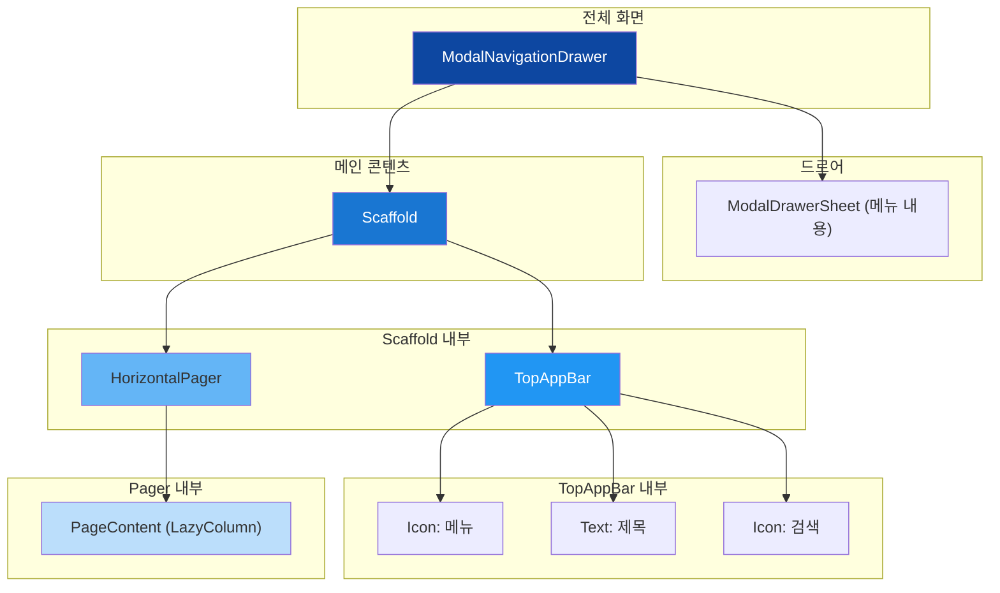

# app_11_jetpack_compose UI 디자인 명세

## 1. UI 요구사항

이 화면은 Jetpack 라이브러리의 주요 UI 컴포넌트들을 조합하여 일반적인 모바일 앱의 구조를 만드는 것을 목표로 합니다.

*   **요구사항 1**: 화면 왼쪽에서 스와이프하거나 상단 바의 메뉴 아이콘을 클릭하면 내비게이션 드로어가 나타나야 합니다.
*   **요구사항 2**: 상단 바에는 "Jetpack Compose"라는 제목, 내비게이션 아이콘, 검색 아이콘이 포함되어야 합니다.
*   **요구사항 3**: 화면 본문은 좌우로 스와이프하여 전환할 수 있는 3개의 페이지로 구성되어야 합니다.
*   **요구사항 4**: 각 페이지는 스크롤 가능한 목록을 포함해야 하며, 각 목록 아이템은 아이콘과 텍스트로 구성됩니다.

## 2. UI 구조 개요

요구사항을 만족시키기 위한 Composable 함수의 계층 구조는 다음과 같습니다.

## 3. 주요 컴포저블 및 개념 설명

*   **`ModalNavigationDrawer`**: 화면의 주 콘텐츠와 화면 밖에서 나타나는 드로어(drawer) 메뉴를 함께 관리하는 컨테이너입니다.
    *   `drawerState`: `rememberDrawerState`를 통해 ���로어의 열림/닫힘 상태(`DrawerValue.Open`, `DrawerValue.Closed`)를 기억하고 제어합니다.
    *   `drawerContent`: 드로어가 열렸을 때 보여줄 내용을 정의하는 슬롯입니다.

*   **`Scaffold`**: `TopAppBar`와 화면 본문을 배치하는 역할을 합니다.

*   **`TopAppBar`**: 내비게이션 아이콘(`navigationIcon`)을 클릭하면 `scope.launch { drawerState.open() }`를 호출하여 코루틴 내에서 드로어를 열도록 구현되어 있습니다.

*   **`HorizontalPager`**: 기존의 `ViewPager2`를 대체하는 Composable로, 좌우로 스와이프 가능한 페이지들을 만듭니다.
    *   `state`: `rememberPagerState`를 통해 현재 페이지 번호, 스크롤 상태 등을 관리합니다.
    *   `pageCount`: 전체 페이지의 개수를 지정합니다.

*   **`LazyColumn`**: 스크롤 가능한 긴 목록을 효율적으로 표시합니다. 화면에 보이는 아이템만 렌더링(Composition)하고, 스크롤되어 사라지는 아이템은 재활용(Recycle)하여 메모리와 성능을 최적화합니다.

*   **`rememberCoroutineScope`**: Composable의 생명주기에 맞춰 코루틴을 실행할 수 있는 `CoroutineScope`를 생성합니다. `drawerState.open()`과 같이 Composable 외부의 상태를 변경하는 비동기 작업을 ��전하게 호출할 때 사용됩니다.

## 4. 미리보기(Preview) 설명

*   **`JetpackLibScreenPreview`**: `@Preview`를 통해 `ModalNavigationDrawer`, `TopAppBar`, `HorizontalPager`, `LazyColumn`이 모두 조합된 최종 화면의 레이아웃을 확인할 수 있습니다.
*   학생들은 이 예제를 통해 여러 Jetpack UI 라이브러리들이 어떻게 서로 상호작용하여 복잡한 화면 구조를 형성하는지 학습할 수 있습니다. 특히 **상태 관리(`drawerState`, `pagerState`)** 와 **비동기 이벤트 처리(`scope.launch`)** 가 실제 앱에서 어떻게 사용되는지 이해하는 데 중점을 둡니다.