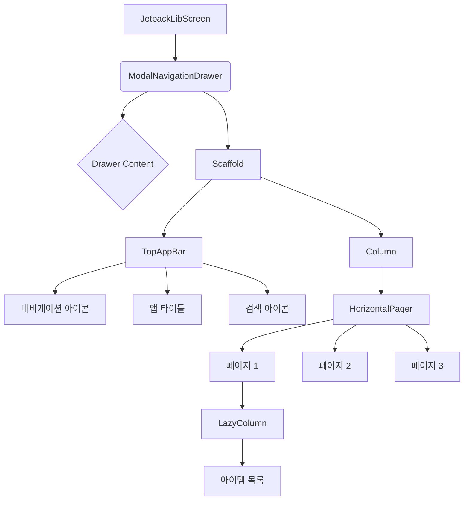

# app_11_jetpack UI 디자인 명세

## 화면 개요

이 화면은 기존 `ch11_jetpack`의 XML 기반 UI를 Jetpack Compose로 재구성한 것입니다. 주요 기능은 다음과 같습니다.

-   **내비게이션 드로어**: 화면 왼쪽에서 나타나는 메뉴입니다.
-   **상단 앱 바**: 화면 제목, 내비게이션 아이콘, 검색 액션 아이템을 포함합니다.
-   **콘텐츠 페이저**: 좌우로 스와이프하여 3개의 다른 목록 페이지를 볼 수 있습니다.

## UI 구조 (Mermaid Diagram)

## 주요 컴포저블 설명

-   **`ModalNavigationDrawer`**: 화면의 가장 바깥쪽 컨테이너로, 내비게이션 드로어와 주 콘텐츠 영역을 관리합니다. `drawerState`를 통해 열고 닫을 수 있습니다. 드로어 내부에는 "드로어 메뉴", "메뉴 항목 1", "메뉴 항목 2" 텍스트가 포함됩니다.
-   **`Scaffold`**: Material Design의 기본 레이아웃 구조(상단바, 본문 등)를 제공합니다. 주 콘텐츠 영역을 구성합니다.
-   **`TopAppBar`**: 화면 상단의 앱 바로, 제목, 내비게이션 아이콘, 액션 아이템 등을 포함합니다.
    -   **내비게이션 아이콘 (햄버거 메뉴)**: 클릭 시 내비게이션 드로어를 엽니다.
    -   **검색 아이콘**: 클릭 시 토스트 메시지("검색 클릭")를 표시합니다.
-   **`HorizontalPager`**: 기존 `ViewPager2`의 역할을 하는 컴포저블로, 여러 페이지를 좌우로 스와이프하여 탐색할 수 있게 해줍니다. `pagerState`로 상태를 관리합니다.
-   **`PageContent` / `LazyColumn`**: 각 페이지의 내용을 구성합니다. `LazyColumn`을 사용하여 스크롤 가능한 아이템 목록을 효율적으로 표시합니다. 각 페이지는 25개의 아이템을 포함합니다.
