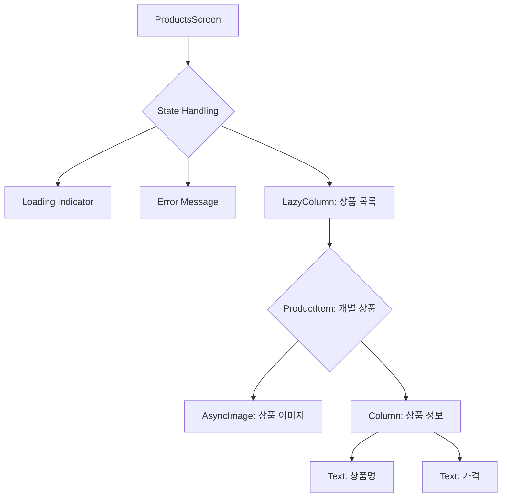

# app_18_fake_store 디자인 명세

## 1. 기능 및 UI 요구사항

이 모듈은 'Fake Store API'를 사용하여 원격 서버로부터 상품 목록을 가져와 화면에 표시하는 것을 목표로 합니다.

- **핵심 기능**:
  - Retrofit 라이브러리를 사용하여 REST API(`https://fakestoreapi.com/products`)를 호출하고 상품 데이터를 수신합니다.
  - 수신된 JSON 데이터를 Kotlin 데이터 클래스(`Product`)로 파싱합니다.
  - Dagger/Hilt를 사용한 의존성 주입(DI) 아키텍처를 구현합니다.
  - `ViewModel`을 사용하여 UI 상태를 관리하고 비즈니스 로직을 처리합니다.

- **UI 요구사항**:
  - 화면에 상품 목록을 세로 스크롤 형태로 표시합니다 (`LazyColumn`).
  - 각 상품 아이템은 상품 이미지, 상품명, 가격을 포함해야 합니다.
  - Coil 라이브러리를 사용하여 상품 이미지 URL을 비동기적으로 로드하고 표시합니다.
  - 데이터 로딩 중에는 로딩 인디케이터(예: `CircularProgressIndicator`)를 표시합니다.
  - API 호출 실패 시 에러 메시지를 표시합니다.

---

## 2. 프로젝트 구조

모듈은 안드로이드 권장 아키텍처 가이드에 따라 `data`, `domain`, `presentation` 계층으로 구분됩니다.

```
app_18_fake_store/
├── src/main/
│   ├── java/com/example/app_18_fake_store/
│   │   ├── di/
│   │   │   └── AppModule.kt            # Hilt 의존성 주입 모듈
│   │   │
│   │   ├── store/
│   │   │   ├── data/
│   │   │   │   ├── remote/
│   │   │   │   │   └── FakeStoreApi.kt     # Retrofit API 인터페이스
│   │   │   │   └── repository/
│   │   │   │       └── ProductsRepositoryImpl.kt # 데이터 소스 구현체
│   │   │   │
│   │   │   ├── domain/
│   │   │   │   ├── model/
│   │   │   │   │   └── Product.kt          # 상품 데이터 클래스
│   │   │   │   └── repository/
│   │   │   │       └── ProductsRepository.kt # 데이터 소스 추상 인터페이스
│   │   │   │
│   │   │   └── presentation/
│   │   │       ├── products_screen/
│   │   │       │   ├── ProductsScreen.kt   # 메인 UI 컴포저블
│   │   │       │   ├── ProductsViewModel.kt # 화면의 상태와 로직 관리
│   │   │       │   └── ProductsState.kt    # UI 상태 데이터 클래스
│   │   │       └── util/
│   │   │           └── Screen.kt           # (필요시) 내비게이션 경로 정의
│   │   │
│   │   ├── ui/
│   │   │   └── theme/                    # Compose 테마
│   │   │
│   │   ├── FakeStoreApp.kt             # Hilt 설정을 위한 Application 클래스
│   │   └── MainActivity.kt             # 앱의 메인 진입점
│   │
│   └── AndroidManifest.xml
│
└── build.gradle.kts
```

---

## 3. UI 구조 개요 (Mermaid)



---

## 4. 주요 컴포저블 설명

- **`ProductsScreen`**:
  - 화면의 전체적인 레이아웃을 구성하는 최상위 컴포저블입니다.
  - `ProductsViewModel`로부터 UI 상태(`ProductsState`)를 구독(observe)합니다.
  - 상태에 따라 로딩 인디케이터, 에러 메시지, 또는 상품 목록(`LazyColumn`)을 조건부로 렌더링합니다.

- **`ProductItem`**:
  - `LazyColumn` 내에서 개별 상품 하나를 표시하는 컴포저블입니다.
  - `Product` 객체를 인자로 받아 UI에 필요한 데이터를 바인딩합니다.
  - `Row` 또는 `Column`을 사용하여 이미지와 텍스트 정보를 배치합니다.

- **`AsyncImage` (Coil)**:
  - `ProductItem` 내에서 상품 이미지를 표시하는 데 사용됩니다.
  - `model` 인자로 상품의 이미지 URL을 전달받아 비동기적으로 이미지를 로드하고 표시합니다.
  - 로딩 중이나 실패 시 보여줄 플레이스홀더(placeholder)나 에러 이미지를 설정할 수 있습니다.
