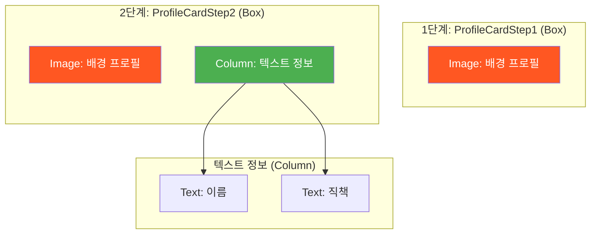

# app_22_box UI 디자인 명세

## 1. UI 요구사항

이 화면은 `Box` 레이아웃을 사용하여 UI 요소들을 겹쳐서 배치하는 방법을 단계별로 학습하는 것을 목표로 합니다.

*   **1단계 요구사항**: 프로필 이미지가 배경으로 표시되어야 합니다.
*   **2단계 요구사항**: 1단계에서 만든 배경 이미지 위에 오른쪽 하단에 이름("홍길동")과 직책("SW 엔지니어") 텍스트가 세로로 표시되어야 합니다.

## 2. UI 구조 개요

요구사항을 만족시키기 위한 Composable 함수의 계층 구조는 다음과 같습니다.

## 3. 주요 컴포저블 및 개념 설명

*   **`Box`**: `Box`는 자식 Composable들을 겹쳐서(overlapping) 배치할 수 있는 가장 기본적인 레이아웃입니다. 자식들은 `Box` 내부에 쌓이는 순서대로 그려집니다 (나중에 추가된 자식이 위쪽에 그려짐).
    *   `modifier = Modifier.size(300.dp)`: `Box`의 크기를 300x300 dp로 고정합니다.

*   **`Modifier.align(Alignment)`**: `Box`의 자식 Composable에게만 사용할 수 있는 특별한 Modifier입니다. 이 Modifier를 사용하여 `Box` 내에서 자식의 위치를 정렬할 수 있습니다.
    *   `Modifier.align(Alignment.BottomEnd)`: `Column`을 `Box`의 오른쪽 하단(BottomEnd)에 배치합니다.
    *   `Alignment`에는 `TopStart`, `TopCenter`, `Center`, `BottomEnd` 등 다양한 정렬 옵션이 있습니다.

*   **`Image`**: 배경으로 사용될 프로필 이미지를 표시합니다. `modifier = Modifier.fillMaxSize()`를 통해 `Box`의 전체 크기를 채웁니다.

*   **`Column`**: 이름과 직책 텍스트를 세로로 배치하는 역할을 합니다.

## 4. 미리보기(Preview) 설명

*   **`ProfileCardStep1Preview`**: `@Preview`를 통해 `ProfileCardStep1` Composable의 결과물(배경 이미지만 있는 상태)을 확인할 수 있습니다.
*   **`ProfileCardStep2Preview`**: `@Preview`를 통해 `ProfileCardStep2` Composable의 결과물(배경 이미지 위에 텍스트가 추가된 상태)을 확인할 수 있습니다.
*   학생들은 각 단계별 프리뷰를 통해 `Image` 위에 `Column`이 어떻게 겹쳐서 표시되는지, 그리고 `Modifier.align()`이 `Box` 내에서 자식의 위치를 결정하는 데 어떻게 사용되는지 시각적으로 이해할 수 있습니다.