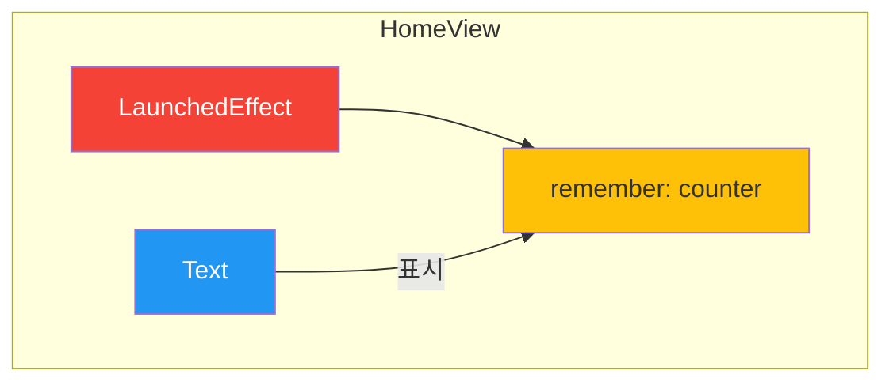

# app_22_newsapp UI 디자인 명세

## 1. UI 요구사항

이 화면은 `LaunchedEffect`를 사용하여 Composable의 생명주기에 맞춰 특정 코드를 한 번만 실행하는 방법을 학습하는 것을 목표로 합니다.

*   **요구사항 1**: 화면에 "자동 카운트: [숫자]" 형식의 텍스트가 표시되어야 합니다.
*   **요구사항 2**: 화면이 처음 나타났을 때부터, 숫자가 1초에 1씩 자동으로 증가해야 합니다.

## 2. UI 구조 개요

이 화면은 매우 단순한 구조를 가집니다.

## 3. 주요 컴포저블 및 개념 설명

*   **`var counter by remember { mutableStateOf(0) }`**: 카운터의 현재 값을 저장하고 기억하는 상태 변수입니다. 이 값이 변경되면 `Text` Composable이 자동으로 리컴포지션됩니다.

*   **`LaunchedEffect(Unit)`**: Composable의 생명주기와 연결된 코루틴을 안전하게 실행하기 위한 핵심적인 Side-Effect 핸들러입니다.
    *   **`key1 = Unit`**: `key` 값으로 `Unit`을 전달하면, 이 `LaunchedEffect` 블록은 `HomeView`가 처음 Composition될 때 **단 한 번만** 실행됩니다. 만약 화면이 사라지면(Disposed) 진행 중이던 코루틴은 자동으로 취소됩니다.
    *   **`while (true)`**: `LaunchedEffect` 내에서 무한 루프를 실행합니다.
    *   **`delay(1000)`**: 코루틴을 1초(1000ms) 동안 일시 중단합니다.
    *   **`counter++`**: `counter` 상태 값을 1 증가시킵니다. 이로 인해 `Text`가 새로운 숫자로 다시 그려집니다.
    *   이 코드는 "화면이 살아있는 동안, 1초마다 카운터를 1씩 증가시켜라"는 명령을 수행합니다.

*   **`Text`**: 현재 `counter` 상태 값을 화면에 표시하는 역할을 합니다.

## 4. 미리보기(Preview) 설명

*   **`GreetingPreview`**: `@Preview`를 통해 `HomeView`의 초기 상태("자동 카운트: 0")를 확인할 수 있습니다.
*   학생들은 이 예제를 실행해봄으로써, `LaunchedEffect`가 어떻게 백그라운드 작업(여기서는 1초마다 숫자를 세는 작업)을 처리하고, 그 결과를 `remember` 상태 변수를 통해 UI에 지��적으로 반영하는지 직접 관찰할 수 있습니다. 이는 네트워크 요청, 데이터베이스 접근 등 Composable의 생명주기에 맞춰 한 번만 실행되어야 하는 비동기 작업을 처리할 때 매우 중요한 패턴입니다.
