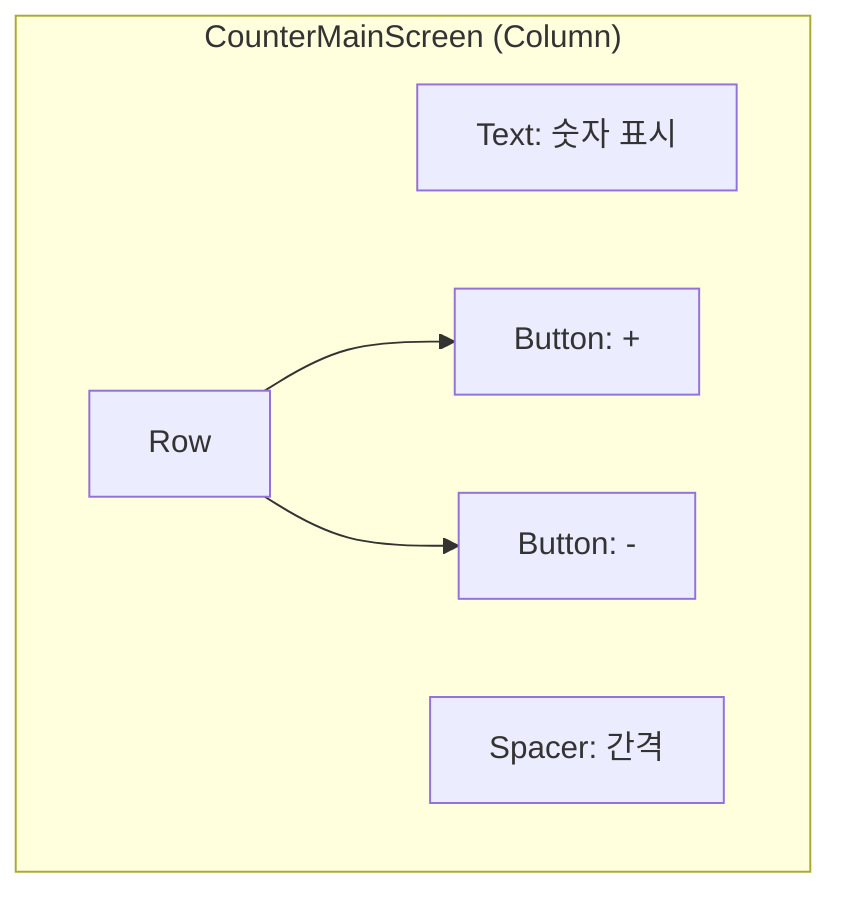
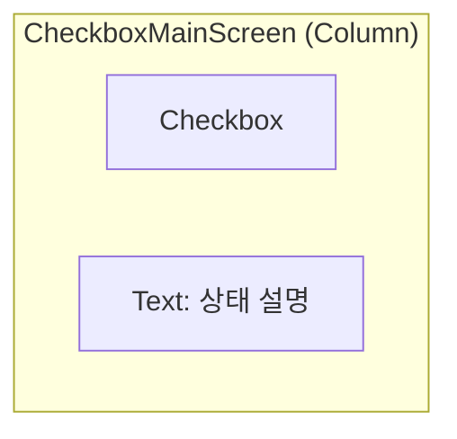

# app_22_state UI 디자인 명세

## 1. UI 요구사항

이 화면은 Jetpack Compose의 가장 기본적인 상태 관리 방법을 두 가지 예제(카운터, 체크박스)를 통해 학습하는 것을 목표로 합니다.

*   **카운터 예제 요구사항**:
    *   **요구사항 1-1**: 화면 중앙에 현재 숫자가 표시되어야 합니다.
    *   **요구사항 1-2**: 숫자 아래에 `+` 버튼과 `-` 버튼이 있어야 합니다.
    *   **요구사항 1-3**: `+` 버튼을 누르면 숫자가 1 증가하고, `-` 버튼을 누르면 1 감소해야 합니다.

*   **체크박스 예제 요구사항**:
    *   **요구사항 2-1**: 화면 중앙에 체크박스가 있어야 합니다.
    *   **요구사항 2-2**: 체크박스 아래에 현재 상태("Checkbox is checked" 또는 "Checkbox is unchecked")를 설명하는 텍스트가 있어야 합니다.
    *   **요구사항 2-3**: 체크박스를 클릭하면 텍스트 내용이 즉시 변경되어야 합니다.

## 2. UI 구조 개요

두 예제 모두 `Column`을 사용하여 UI 요소를 수직으로 배치하는 단순한 구조를 가��니다.

**CounterMainScreen:**

**CheckboxMainScreen:**

## 3. 주요 컴포저블 및 개념 설명

*   **`remember { mutableStateOf(...) }`**: Compose에서 상태를 만드는 공식입니다.
    *   `mutableStateOf(initialValue)`: Compose 런타임이 변경을 감지할 수 있는 `MutableState` 객체를 생성합니다.
    *   `remember`: Composable이 리컴포지션(재구성)될 때 이 상태 값이 초기화되지 않고 계속 유지되도록 보장합니다. `remember`가 없으면 화면이 다시 그려질 때마다 상태가 초기값으로 돌아가 버립니다.

*   **상태(State)와 리컴포지션(Recomposition)**:
    1.  `var counter by remember { mutableStateOf(0) }` 와 같이 상태 변수를 선언합니다.
    2.  사용자가 `Button`이나 `Checkbox`를 클릭하여 상태를 변경하는 이벤트가 발생합니다. (예: `counter++` 또는 `state = it`)
    3.  Compose 런타임은 상태 변경을 감지합니다.
    4.  Compose는 해당 상태를 읽고 있는 모든 Composable(이 예제에서는 `Text`)을 **리컴포지션(Recomposition)**, 즉 다시 실행하여 화면을 새로운 상태로 업데이트합니다.
    *   이것이 바로 **"상태가 UI를 주도한다"** 는 Compose의 핵심 선언적 UI 패러다임입니다.

*   **`CounterMainScreen`**: `Int` 타입의 상태(`counter`)를 사용하여 숫자를 관리하고, `Button` 클릭으로 상태를 변경합니다.

*   **`CheckboxMainScreen`**: `Boolean` 타입의 상태(`state`)를 사용하여 체크 여부를 관리합니다.
    *   `Checkbox` Composable은 `checked` 파라미터로 현재 상태를 표시하고, `onCheckedChange` 람다를 통해 사용자의 클릭 이벤트를 받아 상태를 업데이트합니다.

## 4. 미리보기(Preview) 설명

*   **`CounterMainScreenPreview`**: 카운터 예제의 UI를 보여줍니다.
*   **`CheckboxMainScreenPreview`**: 체크박스 예제의 UI를 보여줍니다.
*   학생들은 두 개의 간단하고 독립적인 예제를 통해, 서로 다른 타입의 데이터(`Int`, `Boolean`)와 다른 종류의 UI 컴포넌트(`Button`, `Checkbox`)에 동일한 상태 관리 원리(`remember` + `mutableStateOf`)가 어떻게 일관되게 적용되는지 비교하며 학습할 수 있습니다.
