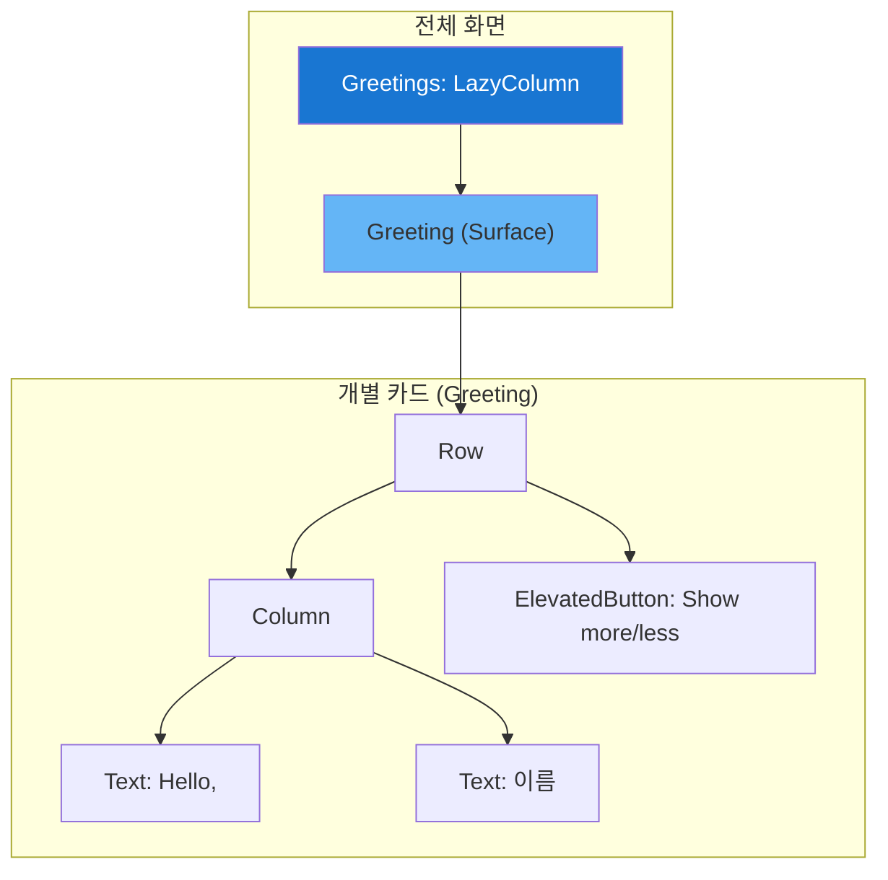

# app_22_wellness UI 디자인 명세

## 1. UI 요구사항

이 화면은 스크롤 가능한 아이템 목록을 만들고, 각 아이템이 독립적인 상태(확장/축소)를 가지며, 상태 변경 시 부드러운 애니메이션 효과를 보여주는 것을 목표로 합니다.

*   **요구사항 1**: 화면에 1000개의 "Hello, [숫자]" 형태의 인사말 카드가 세로로 스크롤되는 목록으로 표시되어야 합니다.
*   **요구사항 2**: 각 카드에는 "Show more" 라는 버튼이 있어야 합니다.
*   **요구사항 3**: "Show more" 버튼을 클릭하면, 해당 카드의 하단 여백이 늘어나는 애니메이션 효과가 나타나고 버튼 텍스트는 "Show less"로 변경되어야 합니다.
*   **요구사항 4**: "Show less" 버튼을 클릭하면, 카드가 원래 크기로 돌아오는 애니메이션 효과가 나타나고 버튼 텍스트는 "Show more"로 돌아가야 합니다.
*   **요구사항 5**: 화면을 회전해도 각 카드의 확장/축소 상태가 유지되어야 합니다.
*   **요구사항 6**: 목록은 성능에 최적화된 방식으로 렌더링되어야 합니다.

## 2. UI 구조 개요

## 3. 주요 컴포저블 및 개념 설명

*   **`LazyColumn` vs. `Column`**:
    *   **`Column`**: 리스트의 모든 아이템을 한 번에 렌더링(Composition)합니다. 아이템이 적을 때는 간단하지만, 수백, 수천 개의 아이템이 있는 경우 심각한 성능 저하를 유발합니다.
    *   **`LazyColumn`**: 화면에 보이는 아이템만 렌더링하고, 스크롤 시 아이템을 재활용하는 '게으른(lazy)' 방식을 사용합니다. 긴 목록을 표시할 때 반드시 사용해야 하는 성능 최적화의 핵심입니다.

*   **`var expanded by rememberSaveable { mutableStateOf(false) }`**: 각 `Greeting` 카드의 확장/축소 상태를 관리합니다.
    *   **`rememberSaveable`**: `remember`와 비슷하지만, 화면 회전이나 프로세스 재생성 시에도 상태를 자동으로 저장하고 복원해주는 강력한 기능입니다. 사용자가 버튼을 눌러 카드를 확장한 상태에서 화면을 회전해도 확장된 상태가 그대로 유지됩니다.

*   **`val extraPadding by animateDpAsState(...)`**: 상태 변화에 따른 애니메이션을 쉽게 구현하는 방법입니다.
    *   `expanded` 라는 `Boolean` 상태가 `true`이면 `48.dp`, `false`이면 `0.dp`를 목표값으로 설정합니다.
    *   Compose는 `expanded` 상태가 변경될 때마다 `extraPadding` 값을 목표값까지 부드럽게 변경하는 애니메이션을 자동으로 실행합니다.
    *   `animationSpec = spring(...)`: 스프링(용수철) 효과를 주어 애니메이션을 더 생동감 있게 만듭니다.

*   **상태 호이스팅 (State Hoisting) 의 부재**: 이 예제에서 중요한 점은 각 `Greeting` 카드가 **자신의 `expanded` 상태를 스스로 관리**한다는 것입니다. `Greetings` 부모 Composable은 자식들의 상태를 알지 못합니다. 이처럼 상태를 실제로 사용하는 가장 낮은 수준의 Composable에 위치시키는 것이 상태 관리의 좋은 패턴 중 하나입니다.

## 4. 미리보기(Preview) 설명

*   **`MyAppStep3Preview`**: `Column`을 사용한 비효율적인 버전의 목록을 보여줍니다. (실제 앱��서는 `Greetings`의 `LazyColumn`을 사용해야 합니다.)
*   학생들은 이 예제를 통해 `LazyColumn`의 필요성을 이해하고, `rememberSaveable`로 어떻게 상태를 영구적으로 보존하는지, 그리고 `animateDpAsState`로 얼마나 쉽게 상태와 연결된 애니메이션을 만들 수 있는지 학습할 수 있습니다.
