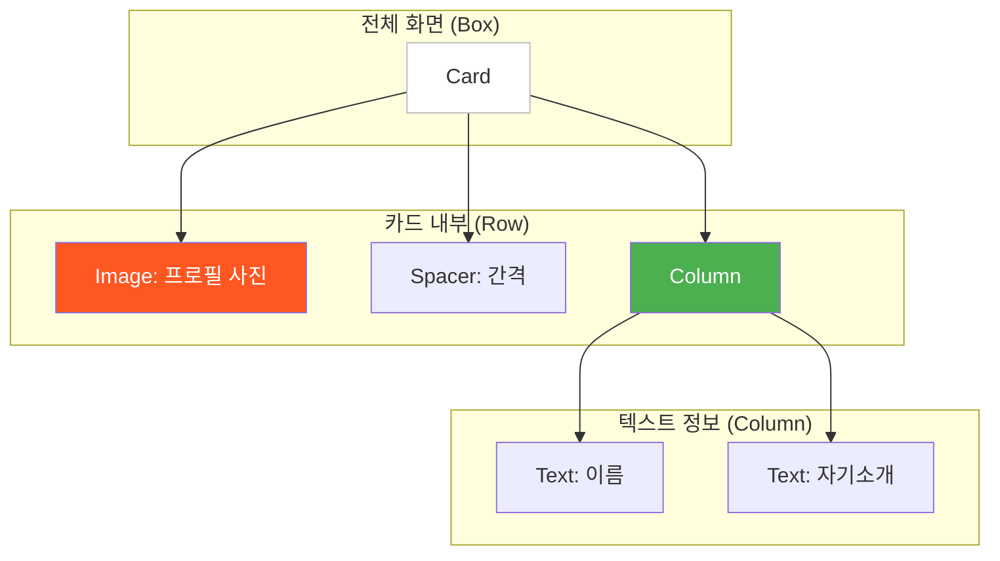

# app_99_profile_card UI 디자인 명세

## 1. UI 요구사항

이 화면은 Jetpack Compose의 기본 레이아웃인 `Row`, `Column`, `Box`와 `Card`를 조합하여 점진적으로 프로필 카드를 완성해나가는 과정을 학습하는 것을 목표로 합니다.

*   **1단계**: 원형으로 잘린 프로필 이미지를 표시합니다.
*   **2단계**: 이미지 오른쪽에 `Row`를 사용하여 이름을 가로로 배치합니다.
*   **3단계**: 이름 아래에 `Column`을 사용하여 자기소개 텍스트를 세로로 배치합니다.
*   **4단계**: 전체 요소를 `Card`로 감싸서 그림자 효과를 주고, `Box` 안에 배치하여 최종 프로필 카드를 완성합니다.

## 2. UI 구조 개요

최종적으로 완성된 프로필 카드의 계층 구조는 다음과 같습니다.

## 3. 주요 컴포저블 및 개념 설명

이 모듈의 핵심은 **점진적 UI 구성(Progressive UI Construction)** 입니다.

*   **`ProfileCardStage1` (Image)**:
    *   `Image` Composable로 이미지를 표시합니다.
    *   `Modifier.clip(CircleShape)`: Modifier를 사용하여 이미지를 원형으로 잘라냅니다.

*   **`ProfileCardStage2` (Row)**:
    *   `Row` 레이아웃은 자식 요소들을 수평(가로)으로 차례대로 배치합니다.
    *   `Image`와 `Text`(이름)를 `Row` 안에 넣어 가로로 나란히 배치합니다.
    *   `Spacer`를 사용하여 두 요소 사이에 일정한 간격을 줍니다.

*   **`ProfileCardStage3` (Column)**:
    *   `Column` 레이아웃은 자식 요소들을 수직(세로)으로 차례대로 배치합니다.
    *   이름 `Text`와 자기소개 `Text`를 `Column` 안에 넣어 세로로 배치합니다.

*   **`ProfileCardBox` (Box + Card)**:
    *   **`Card`**: Material Design의 카드 컴포넌트로, 콘텐츠를 담는 컨테이너 역할을 합니다. 기본적으로 약간의 그림자(elevation)와 둥근 모서리를 가지고 있어 UI 요소를 시각적으로 돋보이게 합니다.
    *   **`Box`**: 다른 레이아웃들을 감싸는 컨테이너로 사용될 수 있습니다. 이 예제에서는 `Card`를 `Box` 안에 배치하여 전체적인 레이아웃을 구성합니다.

## 4. 미리보기(Preview) 설명

이 모듈은 4개의 독립적인 프리뷰를 제공하여 UI가 만들어지는 과정을 단계별로 보여줍니다.

*   **`PreviewStage1`**: 이미지만 있는 초기 상태를 보여줍니다.
*   **`PreviewStage2`**: `Row`를 추가하여 이름이 배치된 상태를 보여줍니다.
*   **`PreviewStage3`**: `Column`을 추가하여 자기소개까지 배치된 상태를 보여줍니다.
*   **`PreviewStage4`**: 최종적으로 `Card`와 `Box`로 감싸 완성된 프로필 카드의 모습을 보여줍니다.

학생들은 각 프리뷰와 해당 Composable 코드를 순서대로 비교하며, 여러 기본 레이아웃을 어떻게 조합하여 복잡한 UI를 점진적으로 완성해 나가는지에 대한 핵심적인 감각을 익힐 수 있습니다.
