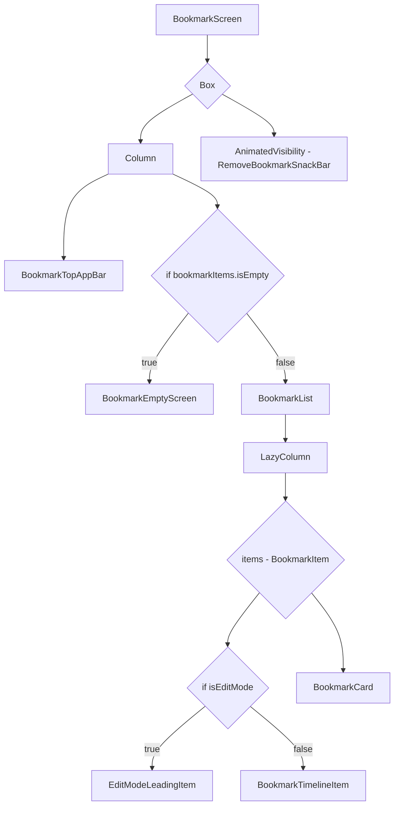

# Bookmark Screen Design

## 1. UI 요구사항
- 사용자가 북마크한 세션들을 시간 순서에 따라 타임라인 형태로 보여줍니다.
- 각 북마크 아이템을 클릭하면 해당 세션의 상세 페이지로 이동해야 합니다.
- 여러 개의 북마크를 한 번에 선택하고 삭제할 수 있는 편집 모드를 제공해야 합니다.
- 북마크한 세션이 없을 경우, 비어있다는 것을 명확하게 알려주어야 합니다.

## 2. UI 구조 개요 (Mermaid)

## 3. 주요 컴포저블 설명
- **BookmarkScreen:**
    - 북마크 화면의 전체적인 레이아웃을 구성합니다.
    - `isEditMode` 상태에 따라 뒤로 가기 버튼의 동작을 제어합니다(편집 모드일 때 편집 모드 종료).
    - 선택된 북마크가 있을 때(`selectedSessionIds`가 비어있지 않을 때) `RemoveBookmarkSnackBar`를 보여줍니다.
- **BookmarkTopAppBar:**
    - 화면 상단에 위치하며, 편집 모드를 켜고 끌 수 있는 버튼을 제공합니다.
    - `isEditMode` 값에 따라 버튼 텍스트가 '편집' 또는 '취소'로 변경됩니다.
- **BookmarkList:**
    - `LazyColumn`을 사용하여 북마크된 세션 목록을 표시합니다.
- **BookmarkItem:**
    - 각 북마크 항목을 나타내는 핵심 컴포저블입니다.
    - `isEditMode` 상태에 따라 다른 `leadingContent`를 보여줍니다.
        - **편집 모드:** `EditModeLeadingItem` (선택/해제 가능한 체크박스)
        - **일반 모드:** `BookmarkTimelineItem` (시간과 순서를 나타내는 타임라인 UI)
    - 클릭 시 `onClickedRedirectItem`을 호출하여 상세 화면으로 이동합니다(편집 모드에서는 비활성화).
- **BookmarkCard:**
    - 세션의 핵심 정보(태그, 트랙, 제목, 발표자)를 담고 있는 재사용 가능한 카드 UI입니다.
- **RemoveBookmarkSnackBar:**
    - 편집 모드에서 하나 이상의 북마크를 선택했을 때 나타나는 스낵바입니다.
    - 클릭 시 `onDeletedSessions`를 호출하여 선택된 북마크들을 삭제합니다.
- **BookmarkEmptyScreen:**
    - 북마크한 세션이 하나도 없을 때, 화면 중앙에 "북마크한 세션이 없습니다." 라는 메시지를 표시합니다.

## 4. 데이터 흐름
- `BookmarkViewModel`은 `GetBookmarkedSessionsUseCase`를 사용하여 북마크된 모든 세션 목록을 가져옵니다.
- 가져온 데이터는 `BookmarkItemUiState` 리스트로 변환되어 `BookmarkUiState.Success` 상태에 저장됩니다.
- `toggleEditMode` 함수를 통해 `isEditMode` 상태를 변경하고, 편집 모드로 진입/해제 시 선택된 항목(`selectedSessionIds`)을 초기화합니다.
- `selectSession` 함수를 통해 편집 모드에서 사용자가 선택한 세션을 `selectedSessionIds`에 추가하거나 제거합니다.
- `deleteSessions` 함수는 `selectedSessionIds`에 포함된 ID들을 `DeleteBookmarkedSessionUseCase`에 전달하여 해당 북마크들을 삭제합니다.
- 일반 모드에서 북마크 아이템 클릭 시 `redirectToSessionScreen` 함수를 통해 해당 세션의 상세 화면으로 이동합니다.
