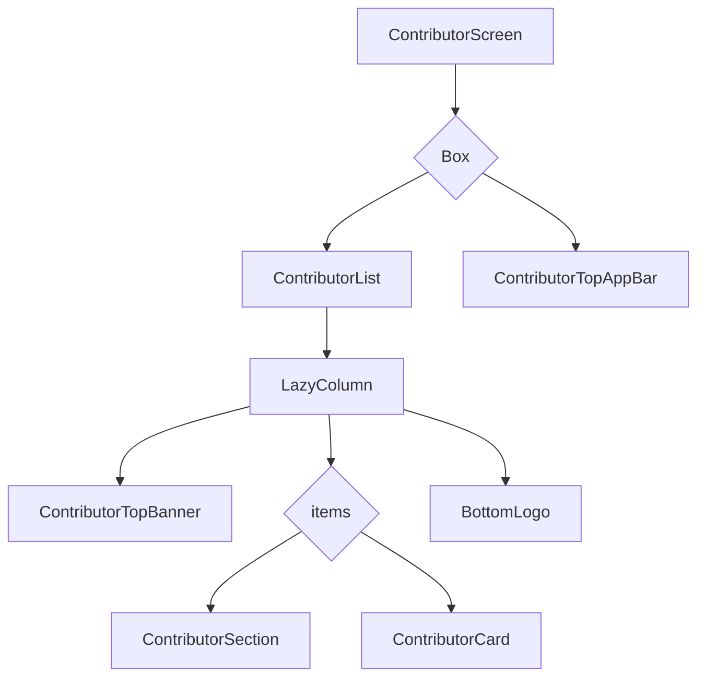

# Contributor Screen Design

## 1. UI 요구사항
- DroidKnights 행사에 기여한 사람들의 목록을 연도별로 구분하여 보여줍니다.
- 사용자가 목록을 스크롤할 때 상단 앱 바의 디자인이 변경되어야 합니다.
- 데이터를 불러오는 동안 로딩 상태를 명확하게 표시해야 합니다.

## 2. UI 구조 개요 (Mermaid)

## 3. 주요 컴포저블 설명
- **ContributorScreen:**
    - `ContributorRoute`에서 호출되며, 기여자 화면의 전체적인 레이아웃을 구성합니다.
    - `Box`를 사용하여 `ContributorList`와 `ContributorTopAppBar`를 겹쳐서 배치합니다.
- **ContributorList:**
    - `LazyColumn`을 사용하여 스크롤 가능한 기여자 목록을 구현합니다.
    - 목록의 최상단에는 `ContributorTopBanner`를, 최하단에는 `BottomLogo`를 표시합니다.
- **ContributorTopAppBar:**
    - 화면 상단에 위치하는 앱 바입니다.
    - `LazyColumn`의 스크롤 위치(`isAppBarAtTop`)에 따라 배경이 투명해지거나 색상이 채워지는 효과가 적용됩니다.
    - 뒤로 가기 버튼을 포함하고 있습니다.
- **ContributorSection:**
    - 기여자 목록을 연도별로 구분하는 헤더 역할을 합니다. (예: "2023", "2024")
- **ContributorCard:**
    - 각 기여자의 이름, 프로필 사진, GitHub 링크 등의 정보를 카드 형태로 보여줍니다.
    - 데이터 로딩 중에는 `showPlaceholder` 값을 true로 설정하여 스켈레톤 UI를 표시합니다.

## 4. 데이터 흐름
- `ContributorViewModel`은 `GetContributorsUseCase`를 사용하여 기여자 데이터를 가져옵니다.
- 가져온 데이터는 `ContributorsUiState`로 변환되어 `uiState`라는 `StateFlow`에 저장됩니다.
- `ContributorScreen`은 `uiState`를 구독하여 기여자 목록의 변화(로딩, 성공, 실패)에 따라 UI를 동적으로 업데이트합니다.
- 데이터 로딩 중 오류가 발생하면 `errorFlow`를 통해 `ContributorRoute`에 전달되고, 스낵바를 통해 사용자에게 알려줍니다.
