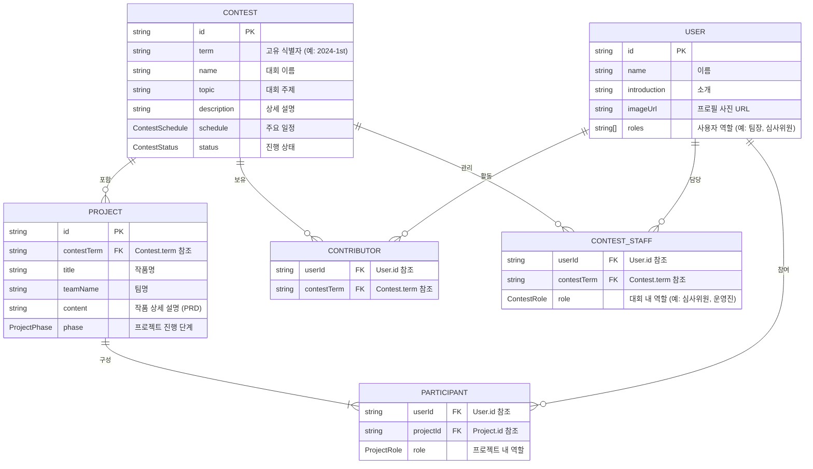

# OpenKnights App - 데이터 모델 설계 (Data Model Design)

## 1. 개요
이 문서는 OpenKnights 앱의 핵심 데이터 모델을 정의합니다. DroidKnightsApp의 구조를 기반으로 하되, OpenKnights 경진대회의 고유한 요구사항(연 2회 개최, 팀 기반 프로젝트, 단계별 심사)을 반영하여 모델을 확장 및 재정의합니다.

## 2. 핵심 데이터 모델 관계도 (ERD)



## 3. 주요 데이터 모델 상세 설명

### 3.1. Contest
대회의 모든 정보를 담는 최상위 중심 객체입니다.

```kotlin
// 대회의 현재 상태
enum class ContestStatus {
    PREPARING,          // 준비 중
    REGISTRATION_OPEN,  // 접수 중
    JUDGING_PRELIMINARY,// 예선 심사 중
    JUDGING_FINAL,      // 본선 심사 중
    COMPLETED,          // 종료
}

// 대회의 주요 일정
data class ContestSchedule(
    val registrationStart: LocalDateTime,
    val registrationEnd: LocalDateTime,
    val preliminarySubmissionEnd: LocalDateTime,
    val finalSubmissionEnd: LocalDateTime,
    val presentationDate: LocalDateTime,
)

// Contest 모델
data class Contest(
    val id: String,
    val term: String,               // 예: "2024-1st"
    val name: String,               // 예: "2024년 1학기 OpenKnights"
    val topic: String,
    val description: String,
    val schedule: ContestSchedule,
    val status: ContestStatus,
)
```

### 3.2. Project
특정 대회(`Contest`)에 출품된 하나의 작품(성과물)을 의미합니다. DroidKnightsApp의 `Session` 역할을 대체합니다.

```kotlin
// 프로젝트의 진행 단계
enum class ProjectPhase {
    REGISTERED("등록"),
    PRELIMINARY_SUBMITTED("예선 제출"),
    PRELIMINARY_PASSED("예선 통과"),
    FINAL_SUBMITTED("본선 제출"),
    FINALIST("본선 진출"),
    PRESENTATION("본선 발표"),
    AWARDED_GRAND("대상 수상"),
    AWARDED_EXCELLENCE("최우수상 수상"),
    AWARDED_ENCOURAGEMENT("우수상 수상"),
}

// Project 모델
data class Project(
    val id: String,
    val contestTerm: String, // Contest.term 참조
    val title: String,
    val teamName: String,
    val content: String,
    val phase: ProjectPhase,
)
```

### 3.3. User
모든 사용자의 마스터 정보입니다.

```kotlin
// User 모델
data class User(
    val id: String,
    val name: String,
    val introduction: String,
    val imageUrl: String,
    val roles: List<String> = emptyList() // 사용자 역할 추가
)
```

### 3.4. Participant
특정 `Project`에 어떤 `User`가 어떤 `Role`로 참여하는지를 연결하는 중간 다리 역할의 모델입니다. DroidKnightsApp의 `Speaker` 개념을 대체 및 확장합니다.

```kotlin
// 프로젝트 내 역할
enum class ProjectRole {
    TEAM_LEADER,
    TEAM_MEMBER,
    MENTOR,
}

// Participant 모델
data class Participant(
    val userId: String,    // User.id 참조
    val projectId: String, // Project.id 참조
    val role: ProjectRole,
)
```

### 3.5. Contributor
OpenKnights 오픈소스 프로젝트 자체에 기여한 사람을 나타냅니다.

```kotlin
// Contributor 모델
data class Contributor(
    val userId: String,      // User.id 참조
    val contestTerm: String, // 기여한 시점의 Contest.term 참조
)
```

### 3.6. ContestRole
대회 내에서 사용자의 역할을 정의하는 Enum 입니다.

```kotlin
enum class ContestRole {
    JUDGE_PRELIMINARY, // 예선 심사위원
    JUDGE_FINAL,       // 본선 심사위원
    STAFF,             // 운영진
    MENTOR,            // 멘토 교수
}
```

### 3.7. ContestStaff
특정 대회에서 특정 User가 어떤 역할을 맡는지 정의하는 모델입니다.

```kotlin
data class ContestStaff(
    val userId: String,      // User.id 참조
    val contestTerm: String, // Contest.term 참조
    val role: ContestRole,
)
```

## 4. TO-BE-DONE (추후 구현)
- **Bookmark 기능:** DroidKnightsApp의 Bookmark 기능을 OpenKnights의 `Project` 모델에 맞게 적용하는 작업은 후순위로 진행합니다.