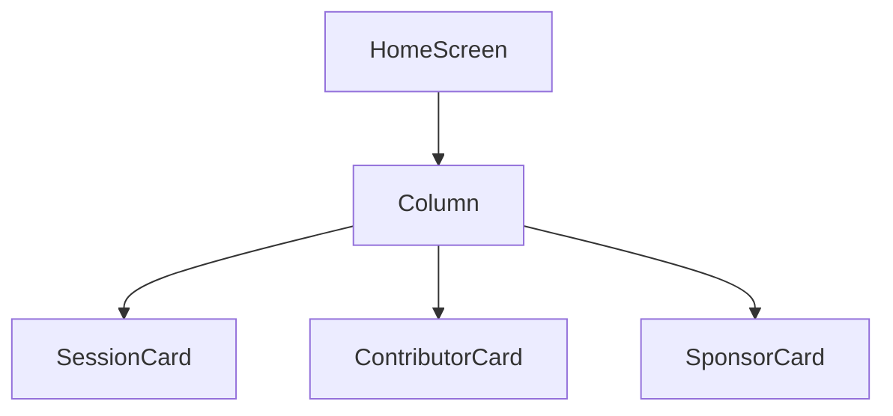

# Home Screen Design

## 1. UI 요구사항
- 앱의 메인 화면으로서, 주요 기능인 세션, 기여자, 스폰서 정보를 요약하여 보여줍니다.
- 각 정보 카드를 클릭하면 해당 상세 화면으로 이동해야 합니다.
- 스폰서 정보는 동적으로 로드하여 표시해야 합니다.

## 2. UI 구조 개요 (Mermaid)

## 3. 주요 컴포저블 설명
- **HomeScreen:**
    - `HomeRoute`에서 호출되며, 화면의 전체적인 레이아웃을 담당합니다.
    - `Column`을 사용하여 자식 컴포저블들을 수직으로 배치합니다.
- **SessionCard:**
    - 세션 정보를 보여주는 카드 형태의 UI입니다.
    - 클릭 시 `navigateSession` 함수를 호출하여 세션 화면으로 이동합니다.
- **ContributorCard:**
    - 기여자 정보를 보여주는 카드 형태의 UI입니다.
    - 클릭 시 `navigateContributor` 함수를 호출하여 기여자 화면으로 이동합니다.
- **SponsorCard:**
    - 스폰서 목록을 보여주는 카드 형태의 UI입니다.
    - `HomeViewModel`로부터 `sponsorsUiState`를 받아 스폰서 목록을 동적으로 표시합니다.
    - 스폰서 로고 클릭 시 `navigateOrganizationSponsor` 함수를 호출하여 해당 스폰서의 웹사이트로 이동합니다.

## 4. 데이터 흐름
- `HomeViewModel`은 `GetSponsorsUseCase`를 사용하여 스폰서 데이터를 가져옵니다.
- 가져온 데이터는 `sponsorsUiState`라는 `StateFlow`에 저장됩니다.
- `HomeScreen`은 `sponsorsUiState`를 구독하여 스폰서 목록의 변화를 감지하고 UI를 업데이트합니다.
- 데이터 로딩 중 오류가 발생하면 `errorFlow`를 통해 `HomeRoute`에 전달되고, 스낵바를 통해 사용자에게 알려줍니다.
