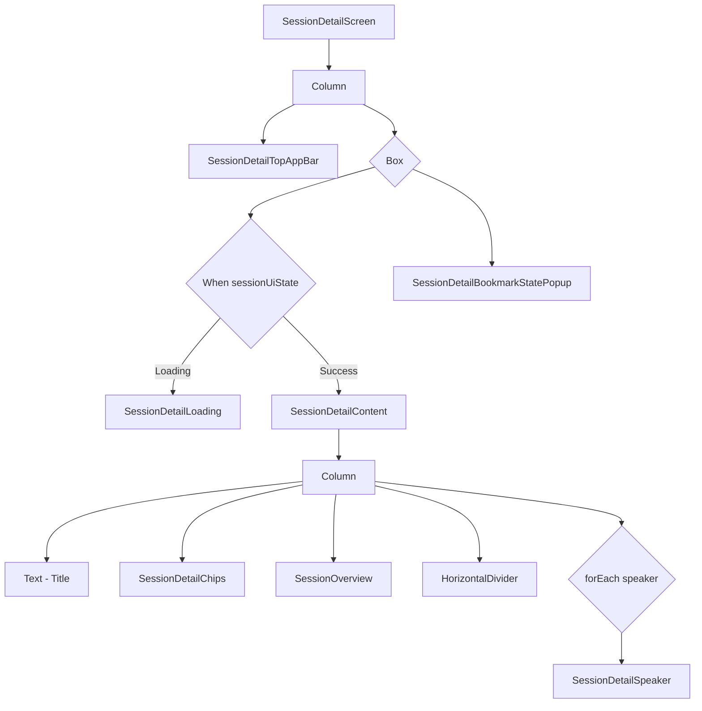

# Session Detail Screen Design

## 1. UI 요구사항
- 선택된 세션의 모든 상세 정보를 명확하게 보여줍니다.
- 사용자는 세션을 북마크하거나 북마크를 해제할 수 있어야 하며, 행동에 대한 시각적인 피드백을 받아야 합니다.
- 세션 내용, 발표자 정보 등 다양한 정보를 체계적으로 보여주어야 합니다.

## 2. UI 구조 개요 (Mermaid)

## 3. 주요 컴포저블 설명
- **SessionDetailScreen:**
    - 세션 상세 화면의 전체 레이아웃을 구성하고, 스크롤을 가능하게 합니다.
    - `sessionUiState`에 따라 로딩 화면 또는 상세 콘텐츠를 보여줍니다.
    - `sessionUiEffect`를 관찰하여 북마크 상태 변경 시 팝업을 띄우는 로직을 처리합니다.
- **SessionDetailTopAppBar:**
    - 화면 상단에 위치하며, 뒤로 가기 버튼과 북마크 아이콘 버튼을 포함합니다.
    - 북마크 버튼은 현재 세션의 북마크 상태(`bookmarked`)에 따라 아이콘 모양이 변경됩니다.
- **SessionDetailContent:**
    - 세션의 상세 정보를 보여주는 메인 콘텐츠 영역입니다.
    - 세션 제목, 칩, 개요, 발표자 정보 등을 순서대로 표시합니다.
- **SessionDetailChips:**
    - 세션의 태그, 트랙(Room) 정보를 칩(Chip) 형태로 보여줍니다.
- **SessionOverview:**
    - 세션의 상세 내용을 "세션 개요"라는 제목과 함께 보여줍니다.
- **SessionDetailSpeaker:**
    - 발표자의 프로필 사진, 이름, 소개를 보여줍니다. 여러 명의 발표자가 있을 경우 각각의 정보를 모두 표시합니다.
- **SessionDetailBookmarkStatePopup:**
    - 북마크 버튼을 클릭했을 때, "북마크에 추가했어요" 또는 "북마크를 취소했어요"와 같은 메시지를 잠시 보여주는 팝업입니다.

## 4. 데이터 흐름
- `SessionDetailViewModel`은 `sessionId`를 받아 `GetSessionUseCase`를 사용하여 해당 세션의 상세 데이터를 가져옵니다.
- `GetBookmarkedSessionIdsUseCase`를 통해 현재 북마크된 세션 ID 목록을 가져와 현재 세션의 북마크 여부를 확인합니다.
- 데이터는 `SessionDetailUiState`로 관리되며, `sessionUiState` `StateFlow`에 저장됩니다.
- 사용자가 북마크 버튼을 클릭하면 `toggleBookmark` 함수가 호출되고, `BookmarkSessionUseCase`를 통해 북마크 상태를 변경합니다.
- 북마크 상태 변경 후 `sessionUiEffect`에 `ShowToastForBookmarkState` 이펙트를 전달하여 화면에 팝업을 띄우도록 합니다.
