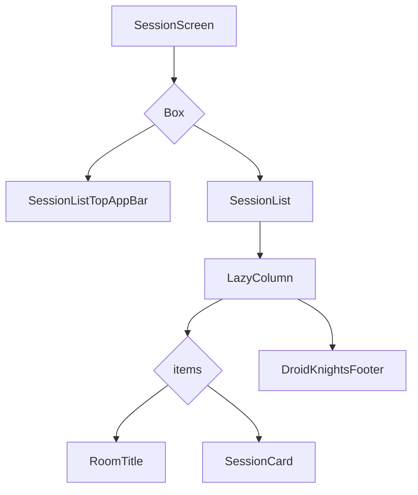

# Session List Screen Design

## 1. UI 요구사항
- 전체 세션 목록을 트랙(Room)별로 구분하여 보여줍니다.
- 각 세션을 클릭하면 상세 화면으로 이동해야 합니다.
- 사용자가 북마크한 세션을 시각적으로 표시해야 합니다.
- 외부 링크를 통해 특정 세션으로 바로 이동하고, 해당 세션을 하이라이트하여 보여주는 기능이 필요합니다.

## 2. UI 구조 개요 (Mermaid)

## 3. 주요 컴포저블 설명
- **SessionScreen:**
    - 세션 목록 화면의 전체적인 레이아웃을 구성합니다.
    - `Box`를 사용하여 `SessionList`와 `SessionListTopAppBar`를 겹쳐서 배치합니다.
    - `scrollToSessionId` 파라미터를 받아 특정 세션으로 스크롤 및 하이라이트하는 로직을 처리합니다.
- **SessionList:**
    - `LazyColumn`을 사용하여 스크롤 가능한 세션 목록을 구현합니다.
    - `sessionState.groups`를 순회하며 각 트랙(Room)별로 세션을 표시합니다.
- **SessionListTopAppBar:**
    - 화면 상단에 위치하는 앱 바입니다.
    - `LazyColumn`의 스크롤 위치에 따라 현재 보이는 트랙(Room)의 제목을 동적으로 표시합니다.
    - 뒤로 가기 버튼을 포함하고 있습니다.
- **RoomTitle:**
    - 각 트랙(Room)의 제목과 구분선을 표시하는 헤더입니다.
- **SessionCard:**
    - 각 세션의 시간, 제목, 발표자, 북마크 여부 등의 정보를 카드 형태로 보여줍니다.
    - `isHighlighted` 값에 따라 특정 세션에 하이라이트 효과를 적용합니다.
- **DroidKnightsFooter:**
    - 목록의 가장 하단에 고정된 푸터 텍스트를 표시합니다.

## 4. 데이터 흐름
- `SessionListViewModel`은 `GetSessionsUseCase`와 `GetBookmarkedSessionIdsUseCase`를 사용하여 전체 세션 목록과 북마크된 세션 ID 목록을 가져옵니다.
- 두 데이터를 조합하여 각 세션의 북마크 여부를 포함한 `SessionUiState`를 생성하고, 이를 `uiState` `StateFlow`에 저장합니다.
- `SessionScreen`은 `uiState`를 구독하여 세션 목록을 표시하고, 북마크 상태가 변경될 때 UI를 업데이트합니다.
- `SessionCard` 클릭 시 `navigateSessionDetail` 함수를 호출하여 해당 세션의 ID와 함께 상세 화면으로 이동합니다.
