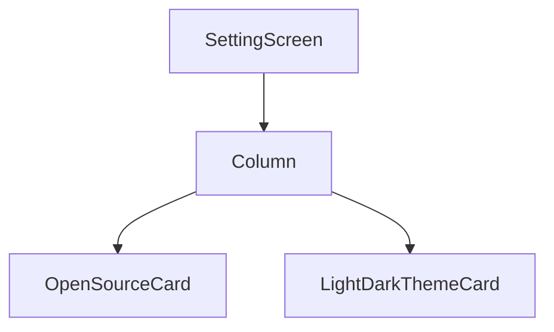

# Setting Screen Design

## 1. UI 요구사항
- 앱의 설정을 변경할 수 있는 화면을 제공합니다.
- 사용자는 앱의 테마(라이트/다크)를 변경할 수 있어야 합니다.
- 사용된 오픈소스 라이선스 정보를 확인할 수 있는 메뉴를 제공해야 합니다.

## 2. UI 구조 개요 (Mermaid)

## 3. 주요 컴포저블 설명
- **SettingScreen:**
    - 설정 화면의 전체적인 레이아웃을 구성합니다.
    - `Column`을 사용하여 자식 컴포저블들을 수직으로 배치합니다.
- **OpenSourceCard:**
    - "오픈소스 라이선스" 정보를 보여주는 카드 형태의 UI입니다.
    - 클릭 시 오픈소스 라이선스 정보 화면으로 이동하는 기능을 수행합니다. (네비게이션 로직은 `SettingViewModel`이 아닌 다른 곳에서 처리될 가능성이 높습니다.)
- **LightDarkThemeCard:**
    - 앱의 테마를 라이트 모드와 다크 모드 간에 전환할 수 있는 스위치를 제공하는 카드입니다.
    - 스위치 상태가 변경되면 `onChangeDarkTheme` 콜백을 호출하여 `SettingViewModel`에 변경 이벤트를 전달합니다.

## 4. 데이터 흐름
- `SettingScreen`은 `SettingViewModel`의 `send` 함수를 호출하여 `SettingAction`을 전달합니다.
- `LightDarkThemeCard`의 스위치 상태가 변경되면 `SettingAction.ChangeDarkTheme` 액션이 `SettingViewModel`로 전달됩니다.
- `SettingViewModel`은 `handleAction` 함수 내에서 전달받은 액션을 처리합니다.
- `ChangeDarkTheme` 액션의 경우, `SettingsRepository`의 `updateIsDarkTheme` 함수를 호출하여 사용자가 선택한 테마 설정을 데이터 저장소에 저장합니다.
- 앱의 실제 테마 변경은 `SettingsRepository`의 데이터를 관찰하는 다른 부분(예: 메인 액티비티 또는 앱의 최상위 컴포저블)에서 이루어질 것으로 예상됩니다.
