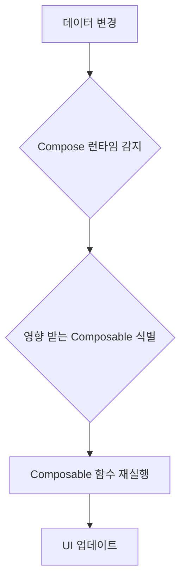

# Jetpack Compose 핵심 원리 이해

Jetpack Compose는 Android UI 개발의 패러다임을 혁신하는 선언적 UI 툴킷입니다. 기존의 명령형(Imperative) 방식과 달리, UI를 '어떻게 그릴지'가 아닌 '무엇을 그릴지'에 집중하게 합니다.

---

## 1. 선언적 UI (Declarative UI) 패러다임

### 기존 명령형 UI (XML + View System)
- UI 요소를 직접 생성하고 속성을 변경하는 방식
- `findViewById`, `setText`, `setVisibility` 등 상태 변경 시마다 뷰를 직접 조작
- UI 상태와 데이터 상태의 동기화 관리가 복잡해짐

### Jetpack Compose 선언적 UI
- UI를 데이터의 함수로 정의
- 데이터가 변경되면 Compose가 자동으로 UI를 다시 그림 (Recomposition)
- 개발자는 UI의 최종 상태만 선언하고, 변경 사항은 Compose가 알아서 처리

---

## 2. 리컴포지션 (Recomposition)

### 리컴포지션이란?
- 데이터가 변경될 때, Compose가 ���향을 받는 Composable 함수들을 다시 실행하여 UI를 업데이트하는 과정
- 효율적인 UI 업데이트를 위해 최소한의 Composable만 다시 실행
- **핵심**: Composable 함수는 상태가 변경될 때마다 여러 번 호출될 수 있음을 인지해야 합니다.

### 리컴포지션 과정 다이어그램



---

## 3. 상태 관리 (State Management)

### 상태(State)란?
- 시간에 따라 변할 수 있는 모든 값 (예: 텍스트 필드의 입력 값, 체크박스의 선택 여부)
- Compose UI는 상태에 따라 동적으로 변화합니다.

### `mutableStateOf`와 `remember`

```kotlin
import androidx.compose.runtime.* // remember, mutableStateOf를 위한 import

@Composable
fun Counter() {
    // `remember`는 Composable이 리컴포지션되어도 상태를 유지하게 합니다.
    // `mutableStateOf`는 관찰 가능한 상태 객체를 생성합니다.
    // `by` 키워드를 사용하면 `value` 속성에 직접 접근하는 대신 변수처럼 사용할 수 있습니다.
    var count by remember { mutableStateOf(0) }

    Button(onClick = { count++ }) {
        Text("Count: $count")
    }
}
```

### 상태 호이스팅 (State Hoisting)
- 상태를 Composable 함수 자체에서 관리하지 않고, 호출자(상위 Composable)로 끌어올리는 패턴
- 장점:
    - **단방향 데이터 흐름**: 상태 변경 로직이 한 곳에 집중
    - **재사용성**: 상태가 없는(Stateless) Composable은 재사용이 용이
    - **테스트 용이성**: 상태와 UI 로직 분리

```kotlin
// 상태를 관리하는 상위 Composable
@Composable
fun SmartCounter() {
    var count by remember { mutableStateOf(0) } // 상태 정의

    // 상태와 상태 변경 이벤트를 하위 Composable에 전달
    DumbCounter(count = count, onIncrement = { count++ })
}

// 상태를 가지지 않는(Stateless) 하위 Composable
@Composable
fun DumbCounter(count: Int, onIncrement: () -> Unit) {
    Button(onClick = onIncrement) { // 전달받은 이벤트 핸들러 사용
        Text("Count: $count")
    }
}
```

---

## 4. 명령형 UI vs 선언적 UI 비교

| 특징         | 명령형 UI (XML + View System)                               | 선언적 UI (Jetpack Compose)                                   |
| :----------- | :---------------------------------------------------------- | :------------------------------------------------------------ |
| **UI 업데이트** | 뷰 객체를 ���접 찾아 속성 변경 (`setText`, `setVisibility`) | 데이터 변경 시 Composable 함수 재실행 (리컴포지션)            |
| **상태 관리**  | 뷰의 내부 상태와 데이터 상태를 수동으로 동기화              | `mutableStateOf`, `remember` 등으로 상태를 관찰 가능하게 관리 |
| **코드 스타일** | UI 정의(XML)와 로직(Kotlin/Java) 분리                     | UI와 로직이 Kotlin 코드 내에서 함께 정의                      |
| **복잡성**     | UI 상태가 복잡해질수록 관리 어려움                          | 단방향 데이터 흐름, 상태 호이스팅으로 복잡성 감소             |
| **성능**       | 런타임 시 뷰 계층 구조 탐색 및 업데이트                     | 효율적인 리컴포지션으로 필요한 부분만 업데이트                |

---

## 요약 및 다음 단계

- Jetpack Compose는 선언적 UI 패러다임을 통해 UI 개발을 간소화합니다.
- 리컴포지션은 데이터 변경에 따라 UI를 효율적으로 업데이트하는 핵심 메커니즘입니다.
- `mutableStateOf`, `remember`, 상태 호이스팅은 Compose에서 상태를 효과적으로 관리하는 중요한 개념입니다.

다음 강의에서는 **컴포저블 함수 작성법**에 대해 더 자세히 알아보겠습니다.
