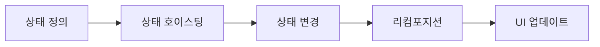

```markdown
---
marp: true
theme: default
paginate: true
header: 'Jetpack Compose 상태 관리 기초'
footer: 'Compose State Management'
---

# Compose 상태 관리 기초
## 리컴포지션과 상태 관리를 위한 핵심 개념

---

## 상태(State)란?
- **시간이 지남에 따라 변경될 수 있는 값**
- UI를 업데이트하는 데 사용되는 데이터
- 상태가 변경되면 **리컴포지션(Recomposition)** 발생

```kotlin
var text by remember { mutableStateOf("") } // 상태 선언

TextField(
    value = text, // 상태 읽기
    onValueChange = { text = it } // 상태 업데이트
)
```

---

## 리컴포지션(Recomposition)
- **상태 변경 시 UI를 업데이트하는 과정**
- 변경된 부분만 효율적으로 다시 그리기
- 컴포저블 함수의 재실행

```kotlin
@Composable
fun Counter() {
    val count = remember { mutableStateOf(0) }
    Button(onClick = { count.value++ }) {
        Text("Clicked ${count.value} times") // 리컴포지션 발생 지점
    }
}
```

---

## 상태 관리의 3대 원칙
1. **단일 진실 공급원(SSOT)**
   - 상태는 한 곳에서만 관리되어야 함
2. **상위 호이스팅(State Hoisting)**
   - 상태를 사용하는 컴포넌트의 공통 상위로 이동
3. **복원 가능한 상태**
   - 기기 회전 등에서도 상태 유지

---

## 상태 호이스팅(State Hoisting)
- **상태를 사용하는 컴포넌트의 공통 조상으로 상태 이동**
- 상태를 불변성으로 노출하고 이벤트 콜백 제공

```kotlin
@Composable
fun ParentComponent() {
    var text by remember { mutableStateOf("") }
    ChildComponent(
        value = text, 
        onValueChange = { newText -> text = newText }
    )
}

@Composable
fun ChildComponent(value: String, onValueChange: (String) -> Unit) {
    TextField(value, onValueChange)
}
```

---

## 상태 유형별 관리 방법
| 상태 유형           | 사용 방법                     | 예시                      |
|---------------------|------------------------------|---------------------------|
| **컴포넌트 내 상태** | `remember` + `mutableStateOf` | 토글 버튼 상태           |
| **화면 수준 상태**   | `ViewModel` + `StateFlow`     | 사용자 프로필 데이터     |
| **전역 상태**       | `CompositionLocal` 또는 DI   | 테마 설정, 사용자 세션   |

---

## remember의 동작 원리
- **컴포지션 동안 값 기억**
- 리컴포지션 시 동일한 값 반환
- 컴포지션을 떠나면 값 삭제

```kotlin
@Composable
fun RememberExample() {
    val counter = remember { 
        mutableStateOf(0) // 초기화는 첫 컴포지션에서만 실행
    }
    Button(onClick = { counter.value++ }) {
        Text("Count: ${counter.value}")
    }
}
```

---

## ViewModel과의 통합
- **화면 수준 상태와 비즈니스 로직 관리**

```kotlin
class CounterViewModel : ViewModel() {
    private val _count = mutableStateOf(0)
    val count: State<Int> = _count

    fun increment() {
        _count.value++
    }
}

@Composable
fun CounterScreen(viewModel: CounterViewModel = viewModel()) {
    val count by viewModel.count
    Button(onClick = { viewModel.increment() }) {
        Text("Count: $count")
    }
}
```

---

## 상태 복원 (rememberSaveable)
- **구성 변경(회전 등) 시 상태 유지**

```kotlin
@Composable
fun LoginScreen() {
    var username by rememberSaveable { mutableStateOf("") }
    TextField(
        value = username,
        onValueChange = { username = it },
        label = { Text("Username") }
    )
}
```

---

## 상태 이벤트 처리 패턴
### 사이드 이펙트 관리

```kotlin
@Composable
fun CounterWithEffect() {
    var count by remember { mutableStateOf(0) }
    
    // 상태가 특정 값에 도달했을 때 작업 수행
    LaunchedEffect(count) {
        if (count > 5) {
            showToast("Count is high!")
        }
    }

    Button(onClick = { count++ }) {
        Text("Count: $count")
    }
}
```

---

## 상태 관리 라이브러리 비교
| 도구                | 특징                          | 사용 시나리오            |
|---------------------|-------------------------------|-------------------------|
| **mutableStateOf**  | Compose 기본 상태 관리        | 간단한 컴포넌트 상태    |
| **StateFlow**       | 코루틴 기반 반응형 스트림     | ViewModel에서 상태 노출 |
| **LiveData**        | AAC 기반 관찰 가능 데이터     | 기존 Android 프로젝트   |
| **RxJava**          | 고급 반응형 프로그래밍        | 복잡한 데이터 스트림    |

---

## 상태 관리 모범 사례
1. **상태 최소화**: 파생 값은 계산해서 사용
   ```kotlin
   val isSubmitEnabled = username.isNotEmpty() && password.isNotEmpty()
   ```
2. **상태 캡슐화**: 상태는 이를 사용하는 컴포저블 근처에 배치
3. **단방향 데이터 흐름**: 상태는 아래로, 이벤트는 위로
4. **상태 분리**: UI 상태와 비즈니스 로직 분리

---

## 상태 변경 디버깅
1. **리컴포지션 카운트 확인**
```kotlin
@Composable
fun DebugRecomposition() {
    var count by remember { mutableStateOf(0) }
    SideEffect {
        println("Recomposed ${++count} times")
    }
}
```
2. **Layout Inspector** 사용
3. **컴포지션 로깅**: `-Pcompose.compiler.log` 옵션

---

## 상태 관리 안티패턴
```kotlin
// ❌ 상태 변수를 컴포지션 밖에서 선언
var globalCount = 0

@Composable
fun BadCounter() {
    Button(onClick = { globalCount++ }) {
        Text("Count: $globalCount") // 리컴포지션 발생 안함
    }
}
```

---

# 상태 관리 체계 요약


1. `mutableStateOf`로 상태 생성
2. `remember`로 컴포지션 간 상태 유지
3. 상태 변경 시 리컴포지션 트리거
4. 변경된 부분만 효율적으로 UI 업데이트

```kotlin
// 상태 관리의 핵심 코드
var state by remember { mutableStateOf(initial) }
```