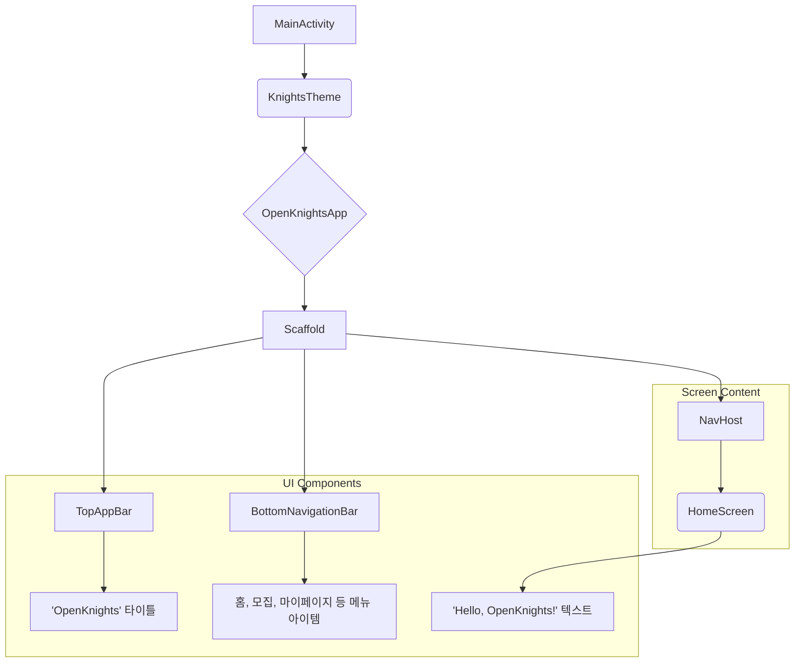

# OpenKnights 앱 설계 명세 (v0.1)

## 1. 개요 (Overview)
이 문서는 'OpenKnights' 안드로이드 앱의 초기 설계 내용을 정의합니다. 'DroidKnights' 앱을 기반으로 하여, Jetpack Compose, Material 3, 그리고 `core-designsystem` 모듈을 통해 구축된 자체 디자인 시스템을 활용하여 개발합니다.

## 2. UI 요구사항 (UI Requirements)
- **일관된 디자인 시스템**: `core-designsystem` 모듈의 `KnightsTheme`을 앱 전체에 적용하여 색상, 타이포그래피, 컴포넌트 스타일의 일관성을 유지합니다.
- **기본 화면 구조**: 앱의 진입점으로서 상단 앱 바(TopAppBar)와 하단 탐색 메뉴(Bottom Navigation)를 포함하는 기본 화면 구조를 가집니다.
- **메인 콘텐츠 표시**: 초기 화면에는 "Hello, OpenKnights!"와 같은 환영 메시지를 표시하여 앱이 정상적으로 실행됨을 확인합니다.
- **모듈화된 아키텍처**: 기능별(feature), 데이터(data), 도메인(domain) 등 모듈화된 구조를 따라 확장성과 유지보수성을 확보합니다.

## 3. UI 구조 개요 (UI Structure Overview)
Mermaid 다이어그램을 사용하여 현재까지 구현된 화면의 컴포저블 계층 구조를 시각적으로 표현합니다.

## 4. 주요 컴포저블 설명
- **`MainActivity.kt`**: 앱의 주 진입점(Entry Point)입니다. `setContent` 블록 내에서 `KnightsTheme`을 적용하고 `OpenKnightsApp` 컴포저블을 호출합니다.
- **`OpenKnightsApp.kt`**: 앱의 최상위 컴포저블입니다. 전체적인 UI 구조를 담당하며, `Scaffold`, `NavHost` 등을 포함합니다.
- **`core-designsystem`의 `KnightsTheme`**: 앱의 디자인 시스템입니다. `MaterialTheme`을 기반으로 커스텀 색상(Color), 서체(Typography), 도형(Shape)을 정의하여 앱 전체에 일관된 스타일을 제공합니다.
- **`Scaffold`**: Material Design의 기본 레이아웃 구조를 구현하는 컴포저블입니다. `TopAppBar`, `BottomAppBar`, `FloatingActionButton` 등의 슬롯을 제공하여 화면을 쉽게 구성할 수 있습니다.
- **`NavHost`**: Jetpack Navigation Compose의 핵심 컴포넌트로, 내비게이션 그래프에 따라 현재 표시할 화면(Composable)을 관리하고 전환합니다.
- **`BottomNavigationBar`**: 화면 하단에 위치하여 주요 기능들(예: 홈, 팀 모집, 마이페이지) 간의 빠른 전환을 돕는 UI 컴포넌트입니다.

## 5. 향후 계획
### Firebase 연동
다음 단계로, 앱의 핵심 백엔드 기능을 구현하기 위해 Firebase와의 연동을 진행할 예정입니다.
- **Firebase Authentication**: 사용자 회원가입 및 로그인 기능을 구현하여 개인화된 서비스를 제공합니다.
- **Firestore Database**: 대회 정보, 팀, 프로젝트, 사용자 데이터 등 앱의 핵심 데이터를 저장하고 실시간으로 동기화합니다.
- **Firebase Storage**: 사용자가 업로드하는 이미지, 발표 자료 등 미디어 파일을 저장하고 관리합니다.
- **Firebase Cloud Messaging (FCM)**: 새로운 소식, 마감일 알림 등 사용자에게 푸시 알림을 전송하는 기능을 구현합니다.

이를 통해 서버리스(Serverless) 아키텍처를 구축하여 확장성 있고 안정적인 앱 서비스를 제공하는 것을 목표로 합니다.
