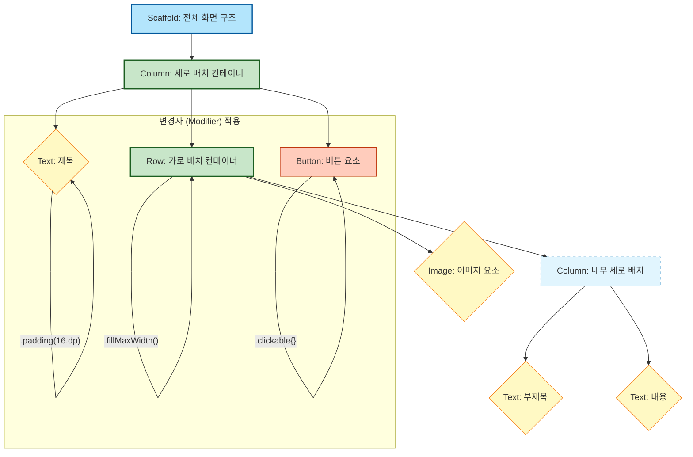

Compose로 화면을 구성하는 방법
컴포즈는 '컨테이너', 'UI 요소', 그리고 '변경자'라는
세 가지 핵심 요소의 조합으로 화면을 만들어냅니다.

화면 구성의 3가지 핵심 요소
컨테이너 (Containers)

다른 UI 요소들을 담는 그릇입니다.

자식들을 어떻게 배치할지 결정합니다. (예: Row, Column, Box)

개별 UI 요소 (Elements)

화면에 실제로 보이는 내용물입니다.

(예: Text, Button, Image)

변경자 (Modifiers)

UI 요소의 외형(크기, 색, 여백)과 동작(클릭 등)을 꾸미는 수식어입니다.

구조 시각화 (Mermaid Diagram)
컴포즈 UI는 '상자(컨테이너) 안에 작은 상자(UI 요소)를 넣고, 각 상자를 꾸미는(변경자)' 레고 블록과 같은 계층 구조를 가집니다.

요약
컨테이너로 구조를 잡고,

개별 UI 요소로 내용을 채운 뒤,

Modifier로 세밀하게 꾸미고 동작을 추가합니다.

이 세 가지 요소의 관계만 이해하면 어떤 복잡한 화면이라도 체계적으로 구성할 수 있습니다.